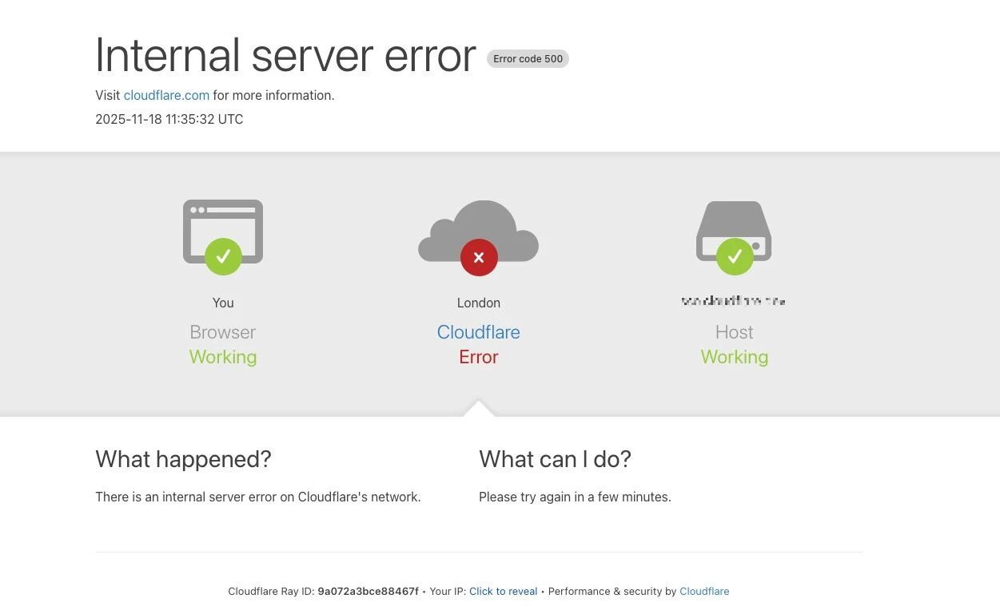
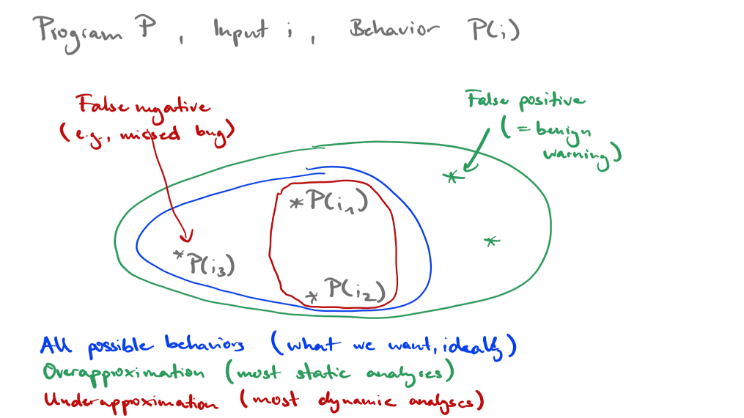
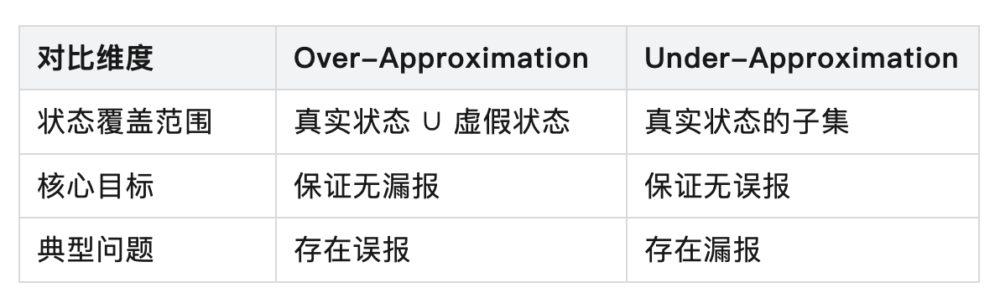
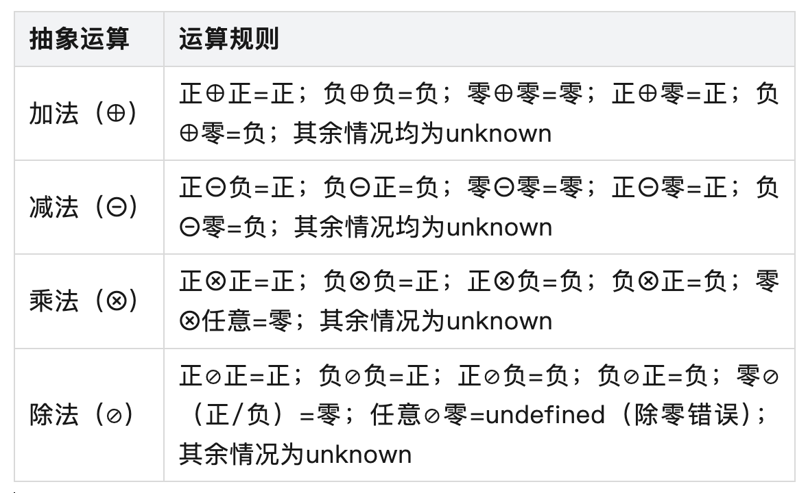
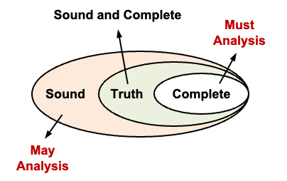
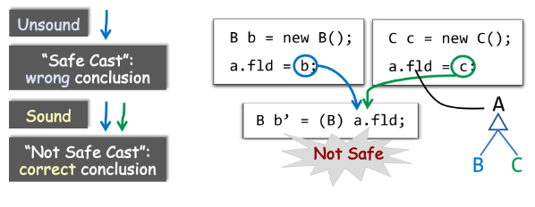

# 高校教学系列：程序分析-基础概念

> 发布时间：2025-11-26T17:55:00+08:00
> 公众号原文：[打开官方页面](https://mp.weixin.qq.com/s?__biz=MzU1NTc1NDMxMQ==&mid=2247484014&idx=1&sn=626a0e866cf890a19b5335cc5bbb555b&chksm=fbce3446ccb9bd5075f64695eeedcb2104bee408b186aa336c77d181c65ad5c2e01bc384eb3e)
> 本文件用于 GitHub 直接阅读：正文顺序来自原文，图片使用仓库中的本地副本；复杂公众号装饰样式请对照 `article.html`。

华中科技大学与蚂蚁基础安全团队联合开设的《静态程序分析原理与实践》课程已正式开课。该课程主要面向华科软件安全方向的研究生，采用理论与实践相结合的教学方式，培养具备扎实理论基础和强实践能力的网络安全专业人才。

本文将重点介绍课程在高校授课环节中理论部分——静态程序分析的基础概念内容。

作者：王申奥，华中科技大学网络空间安全学院博士生，Security PRIDE研究团队成员，导师王浩宇老师。

主页：https://shenaow.github.io/

## Part 01

### 为什么需要静态程序分析?

在软件开发的庞大体系中，程序测试是至关重要的一环，是保障软件质量的核心环节。如今，软件在生活中应用广泛，从Android，Windows等各大操作系统，到各种游戏、智能车机，甚至以太坊智能合约，都属于软件研究的范畴。随着软件的应用场景不断丰富，其复杂度也呈指数级增长。这种日益增长的复杂性，可能导致逻辑错误、安全漏洞及性能瓶颈等问题出现。

一旦这些问题在软件运行时爆发，后果不堪设想。例如，最近的Cloudflare的服务中断导致全球约20%的网站同时陷入瘫痪[1]。2025年11月18日晚，Cloudflare遭遇波及全球的大规模网络故障，导致ChatGPT、X、Spotify、Uber等全球多家知名网站均无法访问。其根本原因是：ClickHouse数据库集群的权限变更未经过充分测试，导致生成的Bot Management系统特征文件因包含大量重复条目体积翻倍，超出预设的200个特征上限，触发Rust代码中未处理的Result::unwrap() panic，进而导致流量路由软件失效。



再如，一些存在安全漏洞的软件，可能会被黑客轻易入侵，给用户带来极大的损失。例如，2021年底爆发的Log4j2漏洞（CVE-2021-44228）就是一个典型案例[2]。作为Java生态中使用率超90%的日志组件，其因核心代码缺乏输入验证与安全测试，存在严重的JNDI注入漏洞，黑客可通过构造特殊日志请求直接控制目标服务器。该漏洞迅速席卷全球，波及阿里云、亚马逊等主流云服务商，以及金融、能源、政务等关键基础设施领域。

这些真实案例都警示着我们，程序测试是不可或缺的。程序测试通过各类系统化的测试方法，对代码行为进行系统性验证，在软件开发早期即可精准识别潜在问题。根据不同标准，可将程序测试分为多种类型，从执行方式来看，主要分为动态测试（Dynamic Analysis）和静态测试（Static Analysis），二者在软件开发过程中形成互补关系，各自发挥独特作用。

动态分析，顾名思义是指在程序实际运行状态下对其进行验证。动态测试的核心是通过观察程序在特定输入下的执行路径、内存状态及输出结果，判断是否满足预期性质，例如：

压力测试（Stress Testing）：在极端条件下（如高负载、大规模输入场景）验证程序的稳定性和性能表现；

模型测试（Model-Based Testing）：基于程序的设计模型或规范生成测试用例，以确保程序实现符合预期设计；

模糊测试（Fuzz Testing）：通过生成大量随机或异常输入，发现程序中的边界问题或潜在安全漏洞。

静态分析，是在不执行程序的前提下，在程序运行前，通过分析代码本身及其结构，发现潜在问题或验证其正确性。静态程序分析通常通过推导或形式化方法分析所有可能的程序执行路径，证明程序行为符合规范，例如：

控制流和数据流分析（Control- and Data-Flow Analysis）：基于程序图表示（如控制流图和数据流图），计算程序的控制依赖和数据依赖，收集其可达性属性；

符号执行（Symbolic Execution）：用符号表达式代替具体值，探索程序中所有可能的执行路径，以发现潜在问题。

动态测试的优势在于其结果的直观性和客观性，其所发现的缺陷均为程序在真实运行场景中可复现的问题，不存在误报。但其局限性也十分突出：首先是覆盖度受限，动态测试仅能验证测试用例覆盖的路径，对于程序中因输入组合爆炸而未被触发的路径则无能为力；其次是介入时机较晚，需等待代码编译运行后才能执行，无法在编码阶段提前发现问题；最后是测试成本较高，大规模测试用例的设计、执行与维护需消耗大量人力物力。

与动态测试相比，静态测试具有三个显著优势：一是介入时机早，可在代码编写完成后立即执行，甚至集成到IDE中实现实时检测，如IDEA的代码检查功能可即时提示未使用变量、空指针（Null Pointer）等问题；二是覆盖范围广，理论上可覆盖程序所有可能的执行路径；三是成本可控，测试规则建立后可实现全自动化执行，无需人工设计大量测试用例。

## Part 02

### 静态程序分析的不可判定性

静态程序分析的核心挑战源于计算理论中的不可判定性（Undecidability）。莱斯定理（Rice's Theorem）告诉我们：对于递归可枚举语言，任何关于程序行为的非平凡性质（Non-trivial Property），都是不可判定的。

### 2.1 Rice's Theorem

要理解莱斯定理，最重要的是需要明确什么是程序的 “Non-trivial Property”。

平凡性质（Trivial Property）：

定义：要么所有程序都满足这个性质，要么所有程序都不满足这个性质。

换句话说，这个性质与程序的具体行为或功能无关，它是所有程序的共性或共性的缺失。

例如：“程序是由字符组成的”，这是一个所有程序都满足的性质，因此是平凡性质，它不涉及程序的语义或行为，我们在静态程序分析中也不感兴趣这类性质。

非平凡性质（Non-trivial Property）：

定义：存在至少一个程序满足该性质，并且存在至少一个程序不满足该性质。

换句话说，这个性质描述了程序某种特定的、可区分的行为或功能。

例如：“程序在某个输入下会输出特定值”，“程序对所有输入都会停机/终止”，“程序在运行时可能发生数组越界”，这些正是我们进行静态分析时想要验证或发现的性质（Interesting Property）。

非平凡性质大约可以理解为我们感兴趣的程序性质，这些性质是与程序的运行时行为相关的，对我们有用的性质。

### 2.2 停机问题的证明（The Halting Problem）

我们可以通过一个有趣的停机问题来理解莱斯定理的（非严格）证明。

停机问题的核心命题为：是否存在一个通用算法Halt，对于任意程序P和输入I，H能够在有限时间内判定“P在输入I上是否会终止运行”？

如果程序P在输入I上最终会终止（停机），Halt(P, I)返回true。

如果程序 P 在输入 I 上会永远运行下去（不停机），Halt(P, I) 返回 false。

图灵在1936年通过对角论证法证明了此类算法H不存在。

假设这样的 Halt 程序存在。我们可以利用它来构造一个新的程序 Q，其行为如下：

```python
def Q(I):
    # I 是一个程序的编码
    if Halt(I, I) == True:
        # 如果程序 I 在输入为自身 I 时会停机
        while True:  # 那么 Q 就进入无限循环，永不停止
            pass
    else:
        # 如果程序 I 在输入为自身 I 时不会停机
        return 0    # 那么 Q 就立即返回，停机
```

现在，我们来考虑Q程序以其自身代码作为输入的情况，即Q(Q)。

假设Halt(Q, Q)返回True：

这意味着Halt程序判定：Q程序在输入为Q时会停机。

根据Q程序的定义，当Halt(I, I)为True时，Q会进入while True无限循环。

因此，如果Halt(Q, Q)为True，实际运行Q(Q)会导致程序永不停止。

矛盾：Halt的判定与程序的实际行为不符。

假设Halt(Q, Q)返回False：

这意味着Halt程序判定：Q程序在输入为Q时不会停机。

根据Q程序的定义，当Halt(I, I)为False时，Q会执行return 0，立即停机。

因此，如果Halt(Q, Q)为False，实际运行Q(Q)会导致程序停止。

矛盾：Halt 的判定再次与程序的实际行为不符。

在两种情况下，我们都得到了矛盾。这说明我们最初的假设 —— 存在一个能解决停机问题的通用程序Halt—— 是错误的。因此，停机问题是不可解的。

### 2.3 从停机问题到一般缺陷检测

停机问题的证明方法具有普适性。我们可以套用同样的逻辑来证明，许多我们关心的程序缺陷检测问题也是不可判定的。

示例：证明 “程序是否存在内存泄漏” 是不可判定的。

假设：存在一个算法 Leak(P)，它能正确判断任意程序 P 是否存在内存泄漏（即所有已分配的内存都被正确释放）。

如果 P 存在内存泄漏，Leak(P) 返回 true。

如果 P 不存在内存泄漏，Leak(P) 返回 false。

我们可以构造一个程序 Q：

```cs
void Q() {
    int* a = malloc(sizeof(int)); // 分配一块内存
    if (Leak(Q)) {
        // 如果 Leak 判定 Q 有内存泄漏
        free(a); // 那么 Q 释放内存，从而没有内存泄漏
        return;
    } else {
        // 如果 Leak 判定 Q 没有内存泄漏
        return; // 那么 Q 直接返回，导致 a 指向的内存泄漏
    }
}
```

现在，我们运行程序 Q：

如果 Leak(Q) 返回 true（判定 Q 有内存泄漏）：

根据 Q 的逻辑，if 条件成立，a 被 free，程序无泄漏。

矛盾：Evil 实际上没有内存泄漏。

如果 Leak(Q) 返回 false（判定 Q 无内存泄漏）：

根据 Q 的逻辑，else 分支执行，程序直接 return，a 未被释放。

矛盾：Evil 实际上存在内存泄漏。

这再次证明了我们的假设是错误的。因此，不存在一个通用算法能判定任意程序是否存在内存泄漏。

同样的方法可以用来证明 “程序是否包含缓冲区溢出”、“程序是否正确计算两个数的和” 等问题都是不可判定的。

莱斯定理将停机问题的结论推广到所有递归可枚举语言的非平凡程序语义性质上，其揭示了静态程序分析的一个根本局限：不存在一个 完美（Perfect） 的静态分析算法，能够精确地、在有限时间内发现任意程序中的所有缺陷或证明其完全正确。

## Part 03

### 静态分析中的近似方法

然而，莱斯定理并非意味着静态分析毫无价值。恰恰相反，它促使研究人员在 精确性（Precision）和 可计算性（Computability）之间进行权衡。核心的解决方案是引入近似（Approximation）技术：

为解决不可判定问题带来的困境，静态程序分析通过 Approximation 缩小分析范围，将无限的程序状态空间映射到有限的抽象空间中。根据近似方向的不同，可分为过近似/上近似（Over-Approximation）与欠近似/下近似（Under-Approximation）两类，二者分别对应不同的分析目标与应用场景。

### 3.1 Over-approximation & Under-approximation

我们用一个例子来介绍二者：

```cs
import random
# 生成一个 [0.0, 1.0) 之间的随机浮点数
r = random.random()
out = "yes"
if r < 0.5:
    out = "maybe"
if r == 1:
    out = "no" # Infeasible Path
print(out)
```

在这个例子中，根据我们的先验知识，我们知道random.random() 生成的随机数 r 严格位于 [0.0, 1.0) 区间内。因此，if r < 0.5: 这个分支有概率被执行，但if r == 1: 这个分支 永远不会被执行，因为r可以无限接近 1，但永远达不到 1。我们称这条路径为 不可达路径（Infeasible Path）。最终，程序的输出只可能是 "yes" 或 "no"。

但是在静态程序分析中，我们通常很难知道程序中的具体执行路径，此时就需要对程序行为进行近似。

近似1：如果我们考虑所有程序中可能执行的路径，即所有分支条件都可能被满足，程序的输出可能有三种：

只执行 out = "yes"；

执行 out = "yes" 和 if r < 0.5: 分支；

执行 out = "yes" 和 if r == 1: 分支。

因此，变量 out 的最终可能取值为 "yes"、"no"或"maybe"。此时我们就是对程序做了Over-Approximation。Over-Approximation 的核心思想是为了确保绝对不会遗漏任何一种 可能发生 的真实行为，分析工具会将一些 不可能发生 的行为（如本例中的 Infeasible Path）也包含进来。

近似2：如果我们只考虑程序中一定执行的路径，即所有分支条件都不满足，程序的输出只有：

只执行 out = "yes"。

因此，变量out 的最终可能取值只有 "yes"。此时的方法就是对程序进行Under-Approximation。Under-Approximation与Over-Approximation相反，其核心思想是仅包含确定的真实状态，排除所有不确定状态。即分析结果所覆盖的状态集合是程序实际运行状态的子集，仅包含能够被严格证明存在的状态。

二者的本质区别在于对不确定性的处理策略：Over-Approximation 对不确定性采取保守态度，以误报换取无漏报；Under-Approximation 则以漏报换取无误报。借用Michael Pradel教授课程上的一张图[3]，可以对二者的核心特征进行总结：





### 3.2 近似的基本方法：抽象法与搜索法

实现近似的技术路径主要分为两类：抽象法（Abstraction-based）与搜索法（Search-based）[4]，二者分别从状态抽象和路径搜索两个维度对程序真实状态来进行近似。

1. 抽象法（Abstraction）：通过将程序的具体状态映射到抽象状态，忽略与分析目标无关的细节，从而将无限状态空间转化为有限空间，例如 SVF，Infer，WALA，Tai-e，以及课程后续要介绍的 YASA，本质上都是基于抽象法的思想。抽象法的典型应用包括：

控制流和数据流分析（Control- and Data-Flow Analysis）

过程间分析（Interprocedure Analysis）

指针分析/指向性分析（Pointer/Point-to Analysis）

抽象解释（Abstract Interpretation）是该方法的理论基础，其核心是构建一个抽象域（Abstract Domain）（如区间域、符号域、指针域），并定义抽象域上的运算（如抽象加法、抽象赋值）来模拟程序的具体运算。

2. 搜索法（Search）：搜索法通过遍历程序的输入空间，查看是否有触发缺陷的输入存在。比如测试就是一种典型的搜索法。搜索法会通过引入各种剪枝和推断算法来减少搜索空间。但由于输入空间可能无限大，同时单个输入可能不停机，所以搜索法只能对程序的部分执行进行分析。搜索法的典型应用包括：

符号执行（Symbolic Execution），例如KLEE，SymbolicPathFinder, JBSE等工具都是基于符号执行的工具

此外，搜索法不止用于静态分析，像模糊测试、混合执行（Concolic Execution）也是基于搜索法的思想。

### 3.3 结合符号分析的例子来理解抽象与近似

我们以一个符号分析来理解静态分析中的抽象方法。对于大多数静态程序分析而言，核心是对程序进行抽象（Abstraction）与上近似（Over-Approximation）（后面会具体介绍为什么静态静态程序分析通常都更关注于Over-Approximation）。

符号分析的核心命题是：给定一个整数的四则运算表达式，我们想要避免计算出结果，但尽量分析结果的符号（正，负，零）。

对符号分析问题的抽象：第一步是先对表达式中的操作数进行抽象。即将表达式中的操作数从具体域映射到抽象域中。具体域指表达式中变量的实际取值范围（如整数集），抽象域则是对具体域的简化抽象，在本例中，我们将抽象域定义为{+, -, 0, unknown, undefined}。若运算结果的符号不确定，即可能取{+, -, 0}，则将对应的运算结果映射为unknown，若运算中涉及除数为零，则直接将对应运算结果映射为undefined。具体域和抽象域的映射示例如下：


对符号分析的近似：为实现符号分析，需为程序的具体运算（+、-、×、/）定义对应的转移函数（Transfer Function），转移函数是近似的核心载体，其基于抽象域的简化特性，对具体运算进行近似模拟，确保在有限抽象空间内可计算，同时必然引入一定程度的近似误差。基于{+, -, 0, unknown, undefined}的抽象域，可以定义转移函数规则如下：



## Part 04

### 静态程序分析常见的另一些术语

### 4.1 Soundness与Completeness

Soundness 与 Completeness 是评价静态分析工具性能的核心指标，二者直接源于程序分析的不可判定性，共同界定了分析结果的正确性边界。


从不可判定性的角度理解，对于任何递归可枚举语言的非平凡性质（Non-trivial Properties）Q，不存在同时满足 Soundness 与 Completeness 的分析算法。因此，静态分析工具必须在二者之间做出权衡，形成两种典型设计策略：

安全优先策略：优先保证 Soundness，允许一定程度的误报（牺牲 Completeness）。通常来讲，分析工具通过 Over-Approximation 来实现 Soundness。

准确优先策略：优先保证 Completeness，允许一定程度的漏报（牺牲 Soundness）。通常来讲，分析工具通过 Under-Approximation 来实现 Completeness。

### 4.2 May Analysis与Must Analysis

可能分析（May Analysis）与必然分析（Must Analysis）是基于近似策略的两种核心分析范式，通常情况下分别对应Over-Approximation 与 Under-Approximation，解决不同类型的性质判定问题。



May Analysis 的核心是回答程序是否可能满足某性质，其分析通常基于 Over-Approximation，覆盖程序所有可能的执行路径与状态。例如，“变量x是否可能未初始化”“程序是否可能存在空指针解引用”，这类问题的核心需求是不遗漏任何潜在风险，因此必须采用 Over-Approximation 确保无漏报。其结论具有可能性，即若分析结果为可能，则存在至少一条路径满足该性质；若结果为不可能，则所有路径均不满足该性质。

Must Analysis 的核心是回答程序是否必然满足某性质，其分析通常基于 Under-Approximation，仅考虑程序确定会执行的路径与状态。例如，“变量x在使用前是否必然已初始化”，这类问题的核心需求是结论绝对可靠，因此采用 Under-Approximation 确保无误报。其结论具有必然性，即若分析结果为必然，则所有路径均满足该性质；若结果为不必然，则存在至少一条路径不满足该性质。

但是需要明确的是，May Analysis 和 Must Analysis 的区分并不是严格的，取决于所分析问题本身的性质。比如我们要分析是否存在内存泄漏，我们需要 May Analysis ，但是如果我们要证明一个程序是内存安全，就需要 Must Analysis。

### 4.3 Soundness 在静态分析中的必要性

在大多数静态程序分析中，Soundness 通常优先于 Completeness。在编译器优化和程序验证等应用中，Unsound 的分析通常导致错误的结论。以一个强制类型转换的例子来看[5]：



Unsound 分析： 分析错误地认为 a.fld 的强制类型转换 (B) a.fld 是 安全的。原因是分析忽略了 a.fld 可能持有类型为 C 的对象（a.fld = c; 的赋值），如果运行时 a.fld 的实际值是 C 类型的对象，则强制类型转换会失败，抛出运行时错误。

Sound 分析： 能够正确地识别出 a.fld 可能持有类型为 B 或 C 的对象。因此，得出结论：强制类型转换 (B) a.fld 不安全，因为 a.fld 可能是 C 类型的对象，而不能被转换为 B。通过这种保守分析，程序在运行时可以避免错误行为。

对于检测程序中的潜在问题（如错误、漏洞、安全性风险等）。如果分析 Unsound，可能会遗漏一些实际存在的问题，即存在 FN，这在实际应用中可能导致严重的后果。如果工具漏掉了一个关键漏洞（如未检测到的缓冲区溢出或 SQL 注入），程序可能会被攻击者利用。

而 Soundness 则保证静态分析不会遗漏程序中的真实问题，这是许多应用场景的第一优先级。虽然 FP 会增加开发者的负担（需要手动排查和验证），但它们不会破坏系统的正确性或安全性。相比漏报，误报的后果通常更容易接受。

## Part 05

### 结语

受限于不可判定性，静态程序分析无法做到精确无误；但通过近似技术等方法论，它又能在可计算范围内最大限度地逼近程序的真实行为。对于静态程序分析研究人员而言，理解不可判定性带来的理论边界，掌握近似策略的平衡艺术，明确 Soundness 与 Completeness 的权衡逻辑，是开展研究的基础。


YASA小助手

YASA基于抽象法思想，融合指针分析、过程间分析等先进程序分析技术，构建了完整的代码理解能力，提供如AST查询、数据流分析、函数调用图分析等多种程序分析功能。

Reference

[1] Cloudflare outage on November 18, 2025.

https://blog.cloudflare.com/18-november-2025-outage/

[2] Log4J – What you should know.

https://quisitive.com/log4j-what-you-should-know/

[3] Program Analysis. Michael Pradel.

https://software-lab.org/teaching/winter2024/pa/lecture_introduction.pdf

[4] 软件分析技术课程讲义. 熊英飞.

https://xiongyingfei.github.io/SA_new/2025/slides/lecnotes.pdf

[5] 静态程序分析. 李越，谭添.

https://cs.nju.edu.cn/tiantan/software-analysis/introduction.pdf

关联阅读

开课啦 | 华中科技大学与蚂蚁基础安全团队联合开设《静态程序分析原理与实践》课程

长按识别二维码

关注“开放式安全基础设施”


在这里与上千名技术精英

交流技术干货&程序分析
