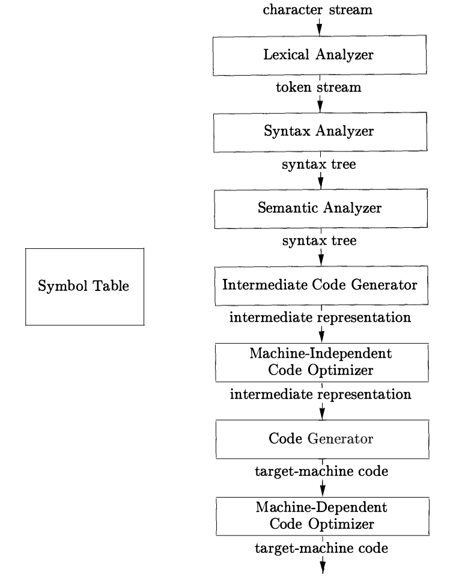
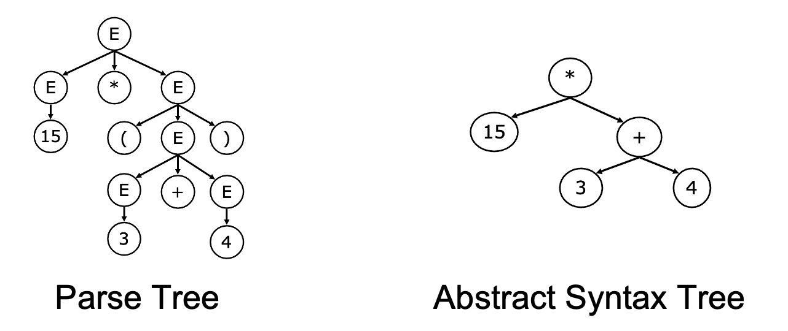

# 高校教学系列：程序分析——中间表示

> 发布时间：2025-12-04T19:56:56+08:00
> 公众号原文：[打开官方页面](https://mp.weixin.qq.com/s?__biz=MzU1NTc1NDMxMQ==&mid=2247484022&idx=1&sn=76fa95ff85549754bad3bc3a505b713f&chksm=fbce345eccb9bd4884e5b19e9ff19edfb697a5e69f5389b16b0f1f8eec0926d60686d7338b87)
> 本文件用于 GitHub 直接阅读：正文顺序来自原文，图片使用仓库中的本地副本；复杂公众号装饰样式请对照 `article.html`。

当你用CodeQL等SAST扫描代码漏洞，或用IDE的“变量重命名”，“代码跳转”等功能时，有没有想过这些工具是如何解析C++的指针、Python的代码块缩进和Java的注解等语言特性，精准捕捉程序本质的？答案藏在中间表示这一技术核心中——它是程序编译与静态分析技术的关键纽带，一头连接千差万别的源代码，一头通向机器码或分析结果。本周的静态程序分析课程，主要关注于IR的技术体系，看看它如何支撑起现代静态程序分析。

作者：王申奥，华中科技大学网络空间安全学院博士生，Security PRIDE研究团队成员，导师王浩宇老师。

主页：https://shenaow.github.io/

## Part 01

### 程序编译过程与中间表示

首先，我们从一个经典的编译过程引入。根据“龙书”[1]的定义，编译器本质上是将源程序映射为在语义上等价的目标程序，通常意义上，编译器的主要任务是分阶段将高级语言的源代码（Source Code）转换为低级机器码（Machine Code）。在每个阶段，编译器都会生成不同的 中间表示（IR, Intermediate Representation），这些 IR 不仅是编译优化的基础，也是静态分析工具的核心技术支撑。



词法分析（Lexical Analysis）

以正则表达式为规则，将源代码字符串拆分为最小语法单元（Token），过滤注释、空格等冗余信息，并检查这些 Token 是否符合语言的词法规则。比如，C 语言中的 int a = 5; 会被分解成 int、a、=、5 和 ; 等 Token。如果某些代码片段含有非法字符或拼写错误（如 5a = int;），词法分析就会报错。词法分析的结果是一个合法的 Token 序列，供后续阶段使用。

语法分析（Syntax Analysis）

基于上下文无关文法（Context-Free Grammar，CFG），将Token序列转化为语法树（Syntax Tree），校验语法结构合法性。例如，int a = 5; 的 AST 会包含一个根节点 “赋值语句”，其子节点分别表示变量类型、变量名和赋值值。语法分析的目标是验证代码是否符合语言的语法规则，例如 int = 5 a; 这样的代码虽然含有合法的 Token，但语法结构不正确，因此无法生成 AST。

语义分析（Semantic Analysis）

基于属性文法为解析树补充语义信息，生成Decorated Syntax Tree，解决“语法正确但逻辑错误”问题。核心包括类型检查、作用域分析、常量折叠等。假如代码中写了 int a = "hello";，类型检查会发现 int 类型的变量不能赋值为字符串，从而报错。通过语义分析，编译器能够捕捉到语法正确但语义错误的问题，使代码逻辑更可靠。此阶段输出的结构化数据已无歧义，为IR生成提供直接输入。

中间代码生成（Intermediate Code Generator）

编译器会将 Decorated AST 转换为更底层的 IR，为后续优化和目标代码生成服务。语法树是一种中间表示形式，它们通常在语法分析和语义分析中使用。而在这个阶段，通常我们讲到的 IR 指的是狭义层面上包括 控制流图（CFG, Control Flow Graph） 和 静态单赋值形式（SSA, Static Single Assignment）两种形式。CFG 通过基本块和控制流边展示程序的所有执行路径，是路径覆盖检测和死代码消除的基础；SSA 则通过为变量引入版本号（如 x1、x2），显式表示变量的定义和使用关系，便于进一步的编译优化和静态分析。

编译优化与机器码生成

以源程序的中间表示形式作为输入，对其进行改进，以便生成更好的目标机器码。编译优化的过程通常包括机器无关优化（与目标机器无关）和机器相关优化（针对目标架构的硬件特性）。机器无关优化主要基于代码的语义和程序逻辑，常见的优化包括常量传播，死代码消除，公共子表达式消除等；而机器相关优化通常依赖于底层硬件架构的特性，常见的优化包括寄存器分配，指令调度等。

如何定义IR？对于 IR 通常没有一个统一的定义，在把源程序翻译成目标代码的过程中，一个编译器可能构造出一个或多个中间表示。而在静态分析领域，通常不同的分析工具也设计了不同的 IR 来服务于分析任务。IR 通常没有好与坏之分，只是对于不同的目标任务，会更适合这个目标任务的 IR 形态。通常来讲，IR 的需要实现的核心目标包括三个：

支撑多语言与多分析场景的通用性（Versatility）

现代静态分析框架需应对两类核心需求：一是多分析任务的协同，例如内存泄漏检测高度依赖调用图分析与指针分析，而 IR 的语言无关性则使其成为这些跨任务数据交互的通用载体。通过前端编译转化为统一IR，可以分析C、Java、Rust等各种语言，而避免分析模块为适配不同语法重复开发；二是新兴领域的需求扩展，随着各种开发框架和应用形态的兴起，静态分析框架需将能力迁移至这些场景，IR通过剥离领域无关的语法细节，聚焦核心计算逻辑，能快速适配新领域的特殊分析需求。

权衡结果的可靠性与性能效率（Performance）

静态分析用户的核心关切是结果质量与分析耗时的平衡：若内存泄漏检测产生大量误报（不complete）或遗漏真实缺陷（不sound），会降低用户信任；若为追求精准而导致分析耗时过长，同样会引发用户抵触。IR通过仅保留操作符、操作数及控制依赖等核心信息，使分析工具无需在语法解析上耗费额外资源，同时IR的规范化结构（如后续将介绍的SSA形式）能加速数据流的计算，确保框架在短时间内生成可靠结果。

提供友好的表示形式以供自定义分析（Productivity）

现代静态分析框架需支持开发者进行高效二次开发，例如内存泄漏检测任务中，需对不同版本的malloc()和free()进行标记与追踪。因此，IR 必须具有高度的可扩展性和可配置性，以减轻二次开发的负担。

下面我们将按照编译过程的不同层次，介绍不同形式的 IR。

## Part 02

### 不同层级 IR 的分类与对比

### 2.1 具体语法树 VS. 抽象语法树

具体语法树（Concrete Syntax Tree，又称为解析树，Parse Tree）与抽象语法树（Abstract Syntax Tree，AST）是编译前端的核心输出，二者均为树形结构，但AST因剥离冗余信息，成为IR的基础形态之一。

具体语法树/解析树

解析树是语法分析的直接产物，其核心作用是根据某种上下文无关文法表示字符串的句法结构，记录语法推导过程，但Parse Tree存在明显缺陷：

冗余信息多

包含非终结符（如E、T、F）、括号、分号等语法标记，例如15*(3+4)的解析树中，“(”和“)”作为独立节点存在，对分析计算逻辑无实际意义。

结构复杂

严格遵循上下文无关文法的推导规则，树形结构层级深，不利于后续分析。因此，Parse Tree仅用于语法合法性校验，无法直接支撑编译优化或静态分析，需要进一步转化为AST。



抽象语法树

AST是对解析树的精简与抽象，仅保留操作符、操作数等核心逻辑，剥离所有语法冗余信息，其核心特点如下：

以15*(3+4)为例，其生成的抽象语法树具有以下三个特性：

① 移除非终结符和括号，结构扁平化；

② 直接体现计算优先级（先算3+4再算乘法）；

③ 便于遍历和分析，如统计节点数量、变量引用等。

通常认为，AST的实现与目标语言是强相关的。目前，工业界普遍使用的主流的AST生成工具包括：

|

工具类型

|

代表工具

|

适用场景

|

通用解析工具

|

ANTLR、Tree-sitter

|

支持多种语言AST生成，值得注意的是，Tree-sitter支持增量解析，因而被众多IDE所采用

|

语言特定的解析工具

|

C/C++：Clang/LLVM、GCC Plugins

Java：JavaParser, EclipseJDT, Spoon

JS/TS：BabelParser, Esprinma, Acorn, TSCompilerAPI

Python：python/ast，LibCST

Go：go/ast

Rust：syn+proc_macro2

|

深度适配特定语言特性，生成高精度AST


YASA小助手

YASA-UAST也是一种通用的AST解析工具，与ANTLR、Tree-sitter不同的是，这些工具虽然提供了多语言支持，但是会将不同语言按照各自的语言规范解析（也即不同语言生成的AST节点类型不完全相同）。而YASA-UAST则提供了一套统一的语言规范来支持多语言，YASA-UAST基于语言特定的解析工具，然后将语言特定的AST节点按照规范转换为UAST节点从而实现统一。

### 2.2 控制流图

控制流图（Control Flow Graph，CFG）的核心目标是将程序潜在执行路径抽象为可计算的图结构。下面参考文献[2]来对控制流图的几种演变来进行介绍。

控制流顺序

控制流顺序（Control Flow Order）是CFG的底层逻辑支撑，它定义了程序语句间的执行依赖关系，是所有控制流分析的起点。其核心定义与价值如下：

定义1（控制流顺序）：程序的控制流顺序是同一函数内语句间的二元关系。若程序执行中存在从语句s₁到s₂的潜在路径，则s₁与s₂满足该关系；若s₂可紧随s₁执行，则二者存在直接控制流顺序。

这一关系为程序分析提供了核心推理依据：例如类型状态属性分析需通过控制流顺序判断对象状态的流转，经典抽象解释算法的实现也以控制流顺序为基础。但此前的AST仅能维持同一树形层级语句的书写顺序，无法表达分支、循环等复杂控制流关系，因此催生了CFG的设计。

语句级CFG

语句级CFG是对控制流顺序的直接图形化表达，其核心是将单个语句（AST中的Statement）作为节点，通过边体现直接控制流关系，定义如下：

定义2（语句级控制流图）：给定函数f及其AST T=(V,E)，对应的CFG为G=(S,E)，其中：

• 节点集S⊂V，代表f中的所有程序语句；

• 边集E⊂S×S，代表语句级控制流边，(s₁,s₂)∈E表示s₁与s₂间存在直接控制流顺序。

构建语句级CFG的核心步骤是遍历AST识别控制流语句，通过if、while、break等关键字确定跳转目标，结合源代码语句顺序生成边。但这种形态存在显著局限：

表达式执行顺序缺失

仅体现语句间关系，无法表达a = b + c * d中c*d先于b+c*d结果执行的内部依赖。

嵌套语句边界模糊：if、for等嵌套结构的语句节点交织，难以区分顺序执行段，增加流敏感分析中状态维护的难度。

冗余边过多：相邻语句均需建立边，导致图结构臃肿，不利于死代码消除等优化。

基础块CFG

为解决语句级CFG的缺陷，现代控制流分析通过平坦化嵌套作用域、合并语句为指令、分组为基本块的方式，构建了基于基本块的CFG，定义如下：

定义3（基本块级控制流图）：给定函数f，其CFG为G=(I,B,E)，其中：

• 指令集I：函数内的原子操作单元（如三地址码），执行算术、内存等单一动作；

• 基本块集B：每个基本块b∈B是指令序列(i₁,i₂,…,iₙ)，满足单入口、单出口，内部指令始终顺序执行；

• 边集E⊂B×B：基本块间的控制流边，(b₁,b₂)∈E表示b₁的最后一条指令与b₂的第一条指令存在控制流顺序。

基本块级 CFG 的核心改进在于以基本块为最小控制单元，通过三个关键设计解决语句级缺陷：

指令化拆分

将语句拆解为三地址码指令，明确表达式内部执行顺序（如a = b + c*d拆分为t1=c*d;a=b+t1）。

基本块分组

通过单入口单出口的规则将指令分组，消除嵌套结构的边界模糊问题，例如if分支内的连续指令被归为同一基本块。

边的精简

仅在基本块间建立边，大幅减少图结构复杂度，便于路径遍历与代码优化。

基本块划分与CFG构建

基本块的单入口单出口特性是CFG有效性的核心保障，其划分规则与CFG构建流程需严格遵循定义3的要求。

基本块定义：基本块是满足“从入口进入后，所有指令必然顺序执行至出口”的指令序列，其划分核心是识别基本块的起始点（leader）。具体规则如下：

1.函数的第一条指令是天然的基本块起始点；

2.控制流跳转的目标指令（如if的分支目标、goto的目标）是基本块起始点；

3.跳转指令的下一条指令是基本块起始点（因跳转可能跳过该指令，需作为新入口）。

确定基本块起始点后，每个基本块由“一个起始点 + 后续所有指令直至下一个起始点”构成。以如下代码片段为例：

```cs
(1) x=1;
(2) y=x-1;
(3) z=x*y;
(4) if z<x goto (7);
(5) a=5;
(6) goto (3);
(7) a=q;
(8) b=x+a;
(9) c=2*a-b;
(10) if p==q goto (12);
(11) goto (3);
(12) return;
```

按规则识别的基本块起始点为(1)(3)(5)(7)(11)(12)，对应的基本块划分结果：

B1：(1)(2)（入口为1，出口为2，顺序执行）；

B2：(3)(4)（入口为3，出口为4，以条件跳转结束）；

B3：(5)(6)（入口为5，出口为6，以无条件跳转结束）；

B4：(7)(8)(9)(10)（入口为7，出口为10，以条件跳转结束）；

B5：(11)（入口为11，出口为11，以无条件跳转结束）；

B6：(12)（入口为12，出口为12，以return结束）。

其中包括三种类型的控制流边：

条件跳转边：条件跳转指令对应两条边，如B4的if p==q goto (12)对应B4→B6（真）、B4→B5（假）。

无条件跳转边：无条件跳转指令对应一条边，如B3的goto (3)对应B3→B2。

顺序执行边：非跳转指令的基本块，自动指向后续基本块，如B1的最后一条指令是顺序执行，对应B1→B2。

终止边：return等终止指令的基本块无出边，如B6。

### 2.3 三地址码、SSA和LLVM IR

按照编译器的解析顺序，AST 通常会被进一步处理为一种类似简单汇编的中间代码，用于优化和分析。这些中间代码通常采用“三地址码”的风格。为了让各种数据流分析和优化更简单、更精确，人们又引入了一种特殊的形式——SSA（静态单赋值形式），给中间表示施加每个变量只赋值一次的约束。LLVM IR则是一种基于三地址码、采用 SSA 形式、语义严格定义的通用 IR。

三地址码

三地址码（Three Address Code，3AC）是一类以单个指令，最多三个元素的表示形成的 IR 风格，即每条指令仅包含一个操作，且操作数与结果的总数不超过三个。具体来说：

3AC的每条指令形如：

result = op arg1, arg2

所以叫“三地址”：result、arg1、arg2（有时是两地址、一地址的变体）。

更抽象接近简单的汇编，但不绑定特定机器：

通常有无限多虚拟寄存器（临时变量）

没有具体寄存器分配、调用约定等细节

对于一段条件分支的源代码片段：

```nginx
if ((a + b) * c < 10) {
    x = 1;
} else {
    x = 2;
}
y = x;
```

其3AC的示例如下：

```java
t1 = a + b
t2 = t1 * c
t3 = t2 < 10
if t3 goto L1
goto L2

L1:
  x = 1
  goto Lend

L2:
  x = 2
  goto Lend

Lend:
  y = x
```

这种线性化处理使指令间的控制流和数据流依赖关系（如t1是t2的输入）清晰可见，为后续分析提供结构化基础。

三地址码对比AST[3]：

AST：

① 更高层次，接近源代码的语法结构；

②通常情况下是与语言强相关的；

③ 缺少控制流信息

3AC：

① 更次层次，接近于机器码；

② 通常情况下是语言无关的；

③ 统一的紧凑形式；

④ 包含控制流信息

三地址码的局限性：在这段三地址码里，x 在两个分支 L1 和 L2 中分别被赋值为 1 和 2，而在合流点 Lend 处写着 y = x。从执行语义上看没有问题：走到 Lend 时，x 要么是 1 要么是 2。但从编译器分析的角度看，这种表示有一个明显的缺陷：在 Lend 这个位置，单看 y = x 这一条指令，无法区分 x 究竟对应哪一次赋值，它既可能来自 L1 中的 x = 1，也可能来自 L2 中的 x = 2，必须结合控制流图向前回溯所有可能路径，找到每条路径上对 x 的最近一次定义。同样地，因为变量名可以在不同基本块、不同路径上被反复赋值，任何关于“某个时刻这个变量到底是什么值”“它是不是常量”“哪些代码依赖它”的推理，都要在 CFG 上做比较复杂的分析和合并。因此，研究人员们引入了 SSA 形式来简化此类分析。

SSA 静态单赋值形式

静态单赋值（Static Single Assignment, SSA）并非独立的IR形态，而是对三地址码的变量定义规范的优化。其核心思想是“每个变量仅被定义一次，多次赋值通过版本化区分”，从根本上解决三地址码的数据流模糊问题，为静态分析的变量追踪提供支撑。

根据论文[2]中对 SSA 的定义：

一个程序符合静态单赋值形式，当且仅当程序中的每个变量只被赋值一次，即在其定义点处赋值。

将上述程序转化为SSA形式为：

```java
t1_1 = a_0 + b_0
t2_1 = t1_1 * c_0
t3_1 = t2_1 < 10
if t3_1 goto L1
goto L2

L1:
  x_1 = 1
  goto Lend

L2:
  x_2 = 2
  goto Lend

Lend:
  x_3 = phi(x_1, L1, x_2, L2)
  y_1 = x_3
```

这意味着 SSA 中的变量不会被重新赋值，从而消除了变量重赋值的歧义。此外，SSA 显式地表示了Def-Use Chain，因为每个变量的使用情况都可以清晰地定位到其定义点。SSA 极大程度上促进了稀疏分析，该分析沿着Def-Use Chain而非控制流边“稀疏地”传播数据流事实。

当控制流合并（Merge）时，需要用一个特殊的phi操作符表示合并后的值。即x_3 = phi(x_1, x_2) 表示“根据控制流来自哪个分支选择对应的版本”。这样，y 使用的是 x_3，而 x_3 的所有可能来源和对应路径都直接体现在这一条 phi 指令里。

SSA的优缺点：

优点是：① 控制流信息间接地被包含在版本化的唯一变量名和 phi函数的合流中；② 变量的每个使用都可追溯到唯一定义，无需遍历所有赋值语句即可构建数据流关系

缺点是：① SSA 形式可能会引入过多的变量名和 phi 函数，表示形式相对复杂；② 构造 SSA 需要额外算法和开销

LLVM IR

LLVM IR 是 LLVM 编译基础设施中最核心的中间表示形式，可以看作是一种“基于三地址码、采用 SSA 形式、并且具有严格类型和语义定义的工业级 IR 语言”。它既继承了三地址码的简单统一指令风格，又系统性地采用了 SSA 的单赋值和 phi 合流机制，并在此基础上增加了完整的类型系统、内存模型、函数与模块结构，使其可以作为多语言前端和多平台后端之间的通用接口层。

在具体形态上，LLVM IR 是一种以基本块（Basic Block）为单位组织的三地址码式 SSA IR。每个函数由若干基本块组成，每个基本块包含一串顺序执行的指令，并以控制流指令（如 br、ret）结尾。指令使用虚拟寄存器风格的 SSA 变量名（如 %1、%x 等），每个名字在函数内只被赋值一次，所有控制流合流处通过 phi 指令来显式选择来自不同前驱块的变量版本。对应上面这段条件分支的源代码程序，其LLVM IR如下（部分简化）：

```perl
define i32 @f(i32 %a, i32 %b, i32 %c) {
entry:
  %t1 = add i32 %a, %b
  %t2 = mul i32 %t1, %c
  %t3 = icmp slt i32 %t2, 10

  br i1 %t3, label %then, label %else

then:
  %x_then = add i32 0, 1
  br label %merge

else:
  %x_else = add i32 0, 2
  br label %merge

merge:
  %x = phi i32 [%x_then, %then], [%x_else, %else]
  %y = add i32 %x, 0
  ret i32 %y
}
```

## 总结

三地址码（3AC）

提供了一种简洁统一的风格，把复杂表达式拆成若干至多三个元素形式的指令，并显式地给出了基本块和控制流结构

SSA 形式

在 3AC 的基础上施加“每个变量只赋值一次”的约束，用变量版本化和 phi 合流，消除了多次赋值带来的数据流歧义

LLVM IR

则可以看作是3AC + SSA 的一个具体实现，许多现代语言（C/C++、Swift等）的编译器都会把源程序先降到 LLVM IR，在这一层完成主要的优化和分析，再面向不同体系结构生成高效机器码

## Part 03

### 结语

本次笔记主要介绍了一些常用的 IR 形式，除了AST，CFG，3AC/SSA之外，数据流图（DFG），控制/数据依赖图（CDG/DDG），程序依赖图（PDG）等其它图形式也通常作为典型的 IR 支持更多静态程序分析任务，可以参考文献[2]进一步学习。此外，静态程序分析的研究者们总是希望能够通过一套统一形式的 IR 来对不同语言不同任务提供通用支持，在设计统一 IR 的过程中也诞生出Compiling（将源代码编译到统一的IR上），Translating（将一种形式的IR翻译为另一种形式），Lifting（从二进制反编译得到IR，binary lifting）等统一化技术[2]，但总的来说，对于统一IR仍然缺乏标准化设计，对于不同的分析任务，通常都有其适用的不同IR统一化方法。


YASA小助手

YASA-UAST是一种基于AST级别的统一IR，其设计主要考虑是：AST相比于SSA更接近源代码结构，能够保留源语言的高级抽象，诸如装饰器，异步函数，各种语法糖等特性能够更友好地在AST层面进行表示。YASA-UAST基于各语言原生AST的节点规范，通过对节点规范进行合并，改造与保留等操作，来构建统一的AST节点规范，并提供从源代码到UAST的转换工具。

## 参考文献

[1] Compilers: Principles, Techniques, & Tools. (Second Edition)

[2] Bowen Zhang, Wei Chen, Hung-Chun Chiu, and Charles Zhang. Unveiling the Power of Intermediate Representations for Static Analysis: A Survey.

[3] 软件分析技术课程讲义. 熊英飞. https://xiongyingfei.github.io/SA_new/2025/slides/lecnotes.pdf

[4] 静态程序分析. 李越，谭添.

https://cs.nju.edu.cn/tiantan/software-analysis/IR.pdf
