# 高校教学系列：程序分析—数据流分析

> 发布时间：2025-12-09T19:53:10+08:00
> 公众号原文：[打开官方页面](https://mp.weixin.qq.com/s?__biz=MzU1NTc1NDMxMQ==&mid=2247484230&idx=1&sn=6a2191643d461d8d8585bc24c02ec136&chksm=fbce356eccb9bc783b460f2994ae1043e0de257204bb39bacaa4e06437bcaedc2e9987c2d7e0)
> 本文件用于 GitHub 直接阅读：正文顺序来自原文，图片使用仓库中的本地副本；复杂公众号装饰样式请对照 `article.html`。

在上一期中，我们探讨了静态分析中的中间表示。本期将为大家深入介绍数据流分析 (Data Flow Analysis) 的三个经典案例，探讨如何利用不动点算法自动求解这些复杂的分析问题。此外，本期会介绍如何将过程内的分析算法拓展到过程间，并且在跨过程分析中保证上下文敏感性。

作者：

何俊洁，华中科技大学网络空间安全学院硕士生，Security PRIDE研究团队成员

主页：https://github.com/glmgbj233

王申奥，华中科技大学网络空间安全学院博士生，Security PRIDE研究团队成员

主页：https://shenaow.github.io/

## Part 01

### 数据流分析

数据流分析是程序分析中最经典的计算模型之一。它的核心思想是在上期所介绍的控制流图 (CFG) 上，对每一个程序点 (Program Point) 计算其特定的程序状态 (Program State) 。可以将其类比为在图上做动态规划 (Dynamic Programming)。我们的目标是根据每条语句的语义（Transfer Function），将状态沿着控制流的边进行传播，直到所有点的状态不再改变（即达到不动点 Fixed Point）。我们通过三个经典的例子来理解数据流分析，这三个例子涵盖了前向/后向分析，May/Must分析的不同组合。

可用表达式分析 (Available Expression)

定义[1]：判断在程序某一点，某个表达式（如 x + y）是否已经被计算过，且自上次计算以来，其操作数（x 或 y）未被重定义

Available Expression常用于编译优化中的公共子表达式消除 (Common Subexpression Elimination)。如果 a+b 在某点可用，我们就不需要重新计算它，可以直接复用之前的结果。

为了分析这个问题，我们需要明确几个前提。首先，Available Expression是Forward Analysis（前向分析/正向分析），因为信息顺着控制流传播。其次，它是一个 Must Analysis。我们需要保证在所有到达该点的路径上，该表达式都已经被计算且有效。

对于Available Expression的分析，我们关心的程序状态（即我们的问题域）是程序中所有表达式的集合，而在分析之初，通产将 Entry 节点设置为空集


（起初没有任何表达式可用）；其他节点通常初始化为全集 (Universal Set)，以便交集操作逐步剔除不可用的表达式。

示例：考虑如下代码片段

```nginx
x = a + b;
y = a * b;
while (y > a + b) {
    a = a - 1;
    x = a + b;
}
```

其控制流图如下：


按照CFG对Available Expression分析，过程如下：

入口点：初始为空集


第1行

(x = a + b)：生成表达式 a + b，此时可用集合为 {a + b}

第2行

(y = a * b)：生成 a * b，此时可用集合为 {a + b, a * b}

循环条件：

第3行

(y > a + b)：生成 a + b

循环体：

第4行

(a = a - 1)：由于 a 被重定义，所有包含 a 的表达式（a + b, a * b）都无效，此时可用表达式集合变为空

第5行

(x = a + b)：重新生成 a + b，此时可用集合为 {a + b}

汇聚点

(Loop Header)：循环条件 (y > a + b)处存在控制流合并，需要考虑来自第2行和第5行的结果，由于Available Expression分析是Must Analysis，需要保证在所有到达该点的路径上，该表达式都已经被计算且有效，因此取循环前路径（{a + b, a * b}）和循环回边路径（{a + b}）的交集，结果为 {a + b}

结论：在循环判断条件 y > a + b 处，a + b 是可用表达式，可以进行优化

根据上述分析和思考过程，我们可以总结并且形式化定义处Available Expression的Meet Operator和Transfer Function，即：

汇聚操作 (Meet Operator)：交集 (Intersection,


)。只有当所有前驱路径都认为表达式可用时，它在汇聚点才可用

公式：

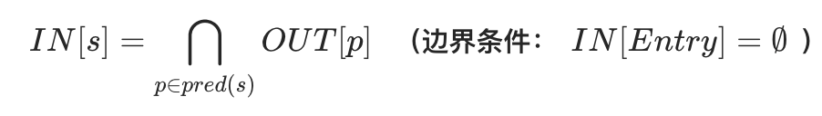

Transfer Function：

公式：

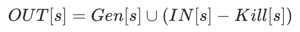

Gen：当前语句计算的表达式（如 z = a + b 生成 a + b）

Kill：操作数被重定义的表达式（如 a = 2 会杀死所有包含 a 的表达式，如 a + b）

最终 Entry/Exit 表：

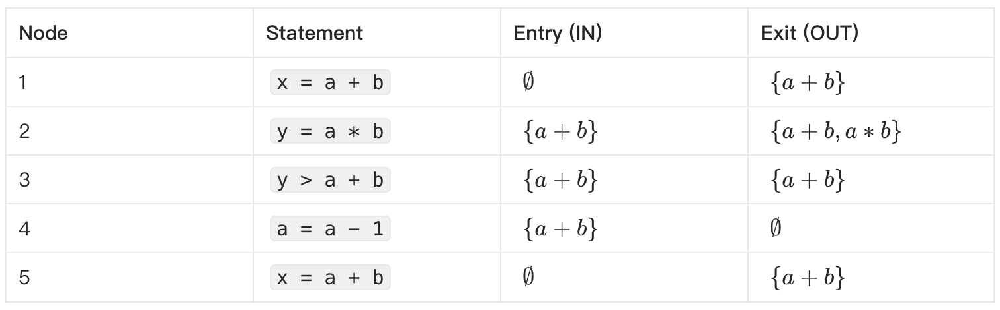

定义数据流分析的六要素

通过上述例子，我们可以总结出定义一个数据流分析问题所需的六个关键要素：

Domain (分析域)：

分析中涉及的所有可能状态的集合。例如，在可用表达式分析中，Domain是所有表达式的集合的幂集。

Direction (方向)：

分析是沿着控制流方向（Forward还是逆着控制流方向（Backward）进行。

Transfer Function (转移函数)：

定义每条语句如何更新程序状态。通常表示为：

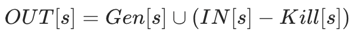

即：新的状态 = 该语句生成的新状态


(输入状态 - 该语句杀死的状态)。

Meet Operator (汇聚操作)：

处理控制流汇聚点（如 if 分支结束处）的逻辑

Must Analysis

（全路径满足）通常使用 交集 (

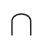

)。

May Analysis

（存在路径满足）通常使用 并集 (


)。

Boundary Condition (边界条件)：

分析开始的入口点（Forward 的 Entry 或 Backward 的 Exit）的初始状态。例如，活跃变量分析从 Exit 开始，初始通常为空集

Initial Values (初始值)：

在算法开始前，对所有程序点的状态进行的默认初始化（通常设为空集或全集，取决于分析类型）

按照上述六要素，我们可以对更多数据流问题进行分析。

到达定值分析 (Reaching Definitions)

定义[1]：

判断变量 v 在某处（例如第 L 行）的定义（Definition）是否能沿着控制流路径到达其使用点（Use），且在途中没有被重定义

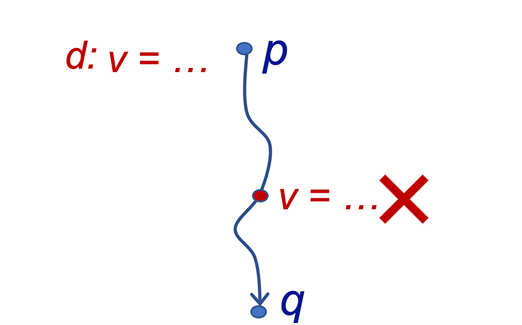

方向 (Direction)：Forward Analysis（前向分析）

性质：这是一个 May Analysis。只要存在一条路径使得定义能够到达，我们就认为它可能到达

汇聚操作 (Meet)：并集 (Union,


)。只要有一个前驱路径传来了定义，该定义就能到达汇聚点

公式：

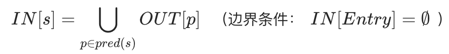

Domain：程序中所有定义的集合（通常表示为 <变量, 语句ID>对）。

初始化：所有节点初始化为空集 （起初假设没有任何定义到达）

Transfer Function：

公式：


Gen：

当前语句生成的定义（如 L: x = 1 生成定义 <x, L>）

Kill：

该变量在程序中其他位置的定义（如 x 的新定义会“杀死”旧定义）

示例：考虑如下代码片段

```cs
int x = 5;      // Node 1: Definition of x
int y = 1;      // Node 2: Definition of y
while (x > 1) { // Node 3: Merge Point (Entry from 2 and 5)
    y = x * y;  // Node 4: Redefinition of y
    x = x - 1;  // Node 5: Redefinition of x
}
```

对应的控制流图如下（节点 3 是节点 2 和节点 5 的汇聚点）：

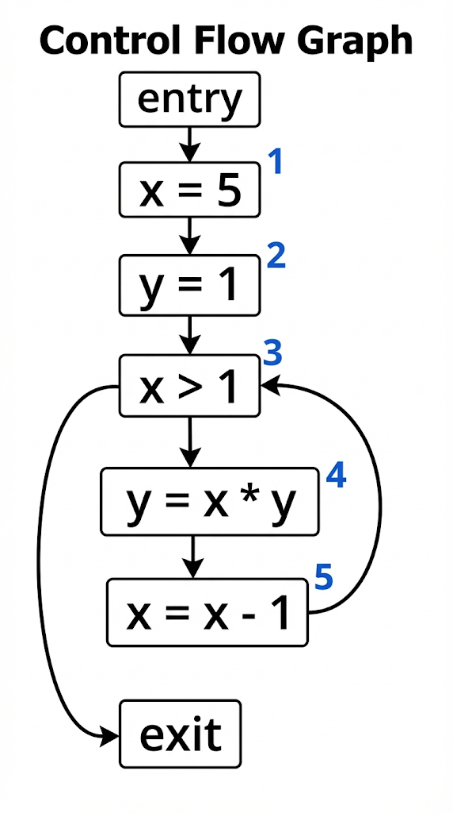

分析过程：

Entry：

初始化为 {<x, ?>, <y, ?>}，? 表示变量尚未定义。

第2行结束：

节点 2 定义了 x 和 y，生成定义集合 {<x, 1>, <y, 2>}

第3行入口 (Merge Point)：

计算公式：

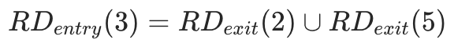

由于是 May Analysis，我们需要取 并集 (Union)

这意味着在节点 3 的入口处，x 的值可能来自节点 2 的定义，也可能来自循环回边节点 5 的定义（如果节点 5 重新定义了 x）

结论：

通过不断迭代计算，直到集合不再变化（不动点），我们可以知道在节点 3 处 x 可能持有的所有定义

最终 Entry/Exit 表：

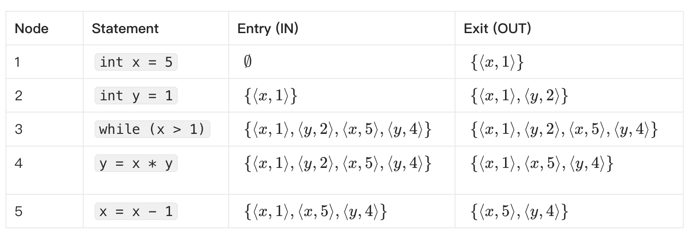

活跃变量分析 (Live Variable Analysis)

定义[1]：

判断变量 v 在某一点的值是否在未来会被使用。如果变量 v 在某点之后会被读取（Use），且在读取前未被重写（Redefine），则称 v 在该点是 Live (活跃) 的；否则是 Dead (不活跃) 的

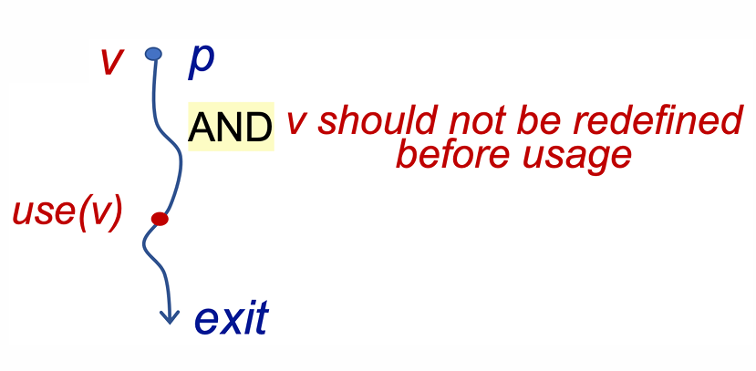

方向 (Direction)：

Backward Analysis（后向分析）。我们需要从程序的出口 (Exit) 往回推导，因为变量是否被使用取决于未来的行为

性质：

这是一个 May Analysis。只要存在一条未来的路径使用了该变量，它就是活跃的

汇聚操作 (Meet)：并集 (Union,


)。只要某一条后继路径需要该变量，它在当前点就是活跃的

公式：

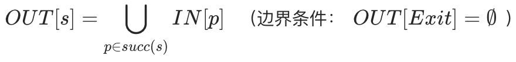

Domain：程序中所有变量的集合。

初始化：

所有节点初始化为空集

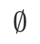

（起初假设没有变量是活跃的）

Transfer Function：

公式：

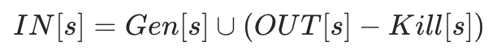

Gen：

在当前语句中被使用 (Use) 且在使用前未被定义的变量（如 y = x + 1 生成活跃变量 x）

Kill：

在当前语句中被定义 (Def) 的变量（如 x = 2 会“杀死” x 的活跃状态，因为旧值被覆盖了，不再需要）

典型应用：

死代码消除 (Dead Code Elimination)。如果给变量 x 赋值的语句之后，x 立即变成 Dead 状态（即没人用），那么这条赋值语句可以被安全删除

示例：考虑如下代码片段

```javascript
x = 2;          // Node 1
y = 4;          // Node 2
x = 1;          // Node 3
if (y > x) {    // Node 4
    z = y;      // Node 5
} else {
    z = y * y;  // Node 6
    x = z;      // Node 7
}
```

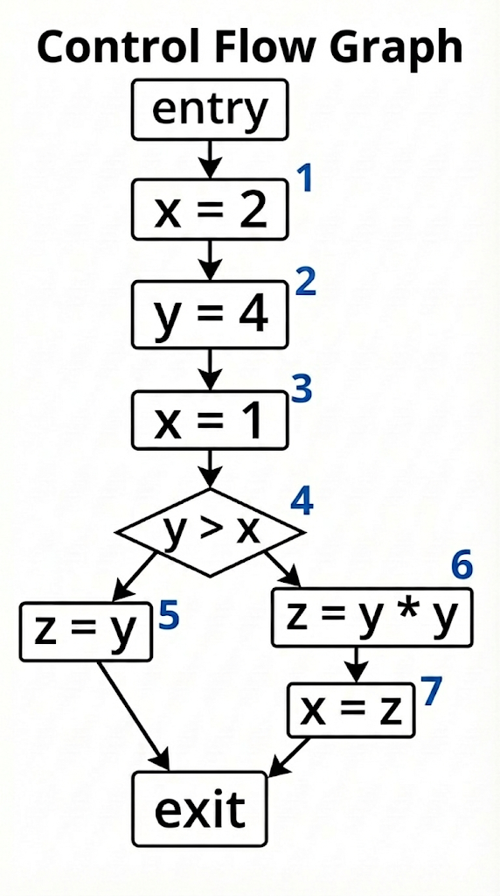

分析过程：

这是一个 Backward Analysis（后向分析），从 Exit 往回推。假设 Exit 处无活跃变量 (


)

分支处理：

Else 分支

(Node 6, 7)：Node 7 (x=z) 使用了 z，定义了 x。Node 6 (z=y*y) 使用了 y，定义了 z。推导得出 Node 6 入口处 y 活跃

Then 分支

(Node 5)：z=y 使用了 y，定义了 z。推导得出 Node 5 入口处 y 活跃

汇聚点

(Node 4 if (y > x))：

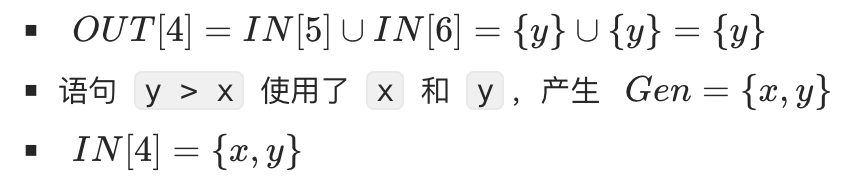

顺序流

(Node 1, 2, 3)：

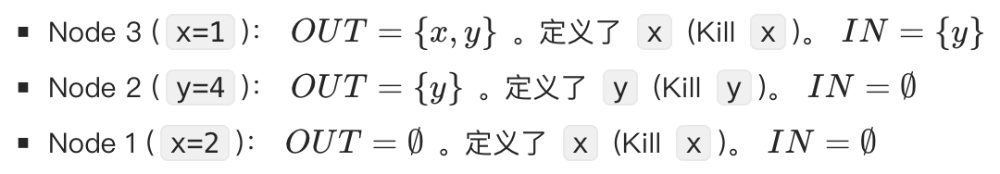

结论：

在 Node 1 的出口处 (

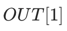

)，x 不是活跃变量，这意味着 x=2 这条语句是死代码 (Dead Code)，可以被安全消除

最终 Entry/Exit 表：

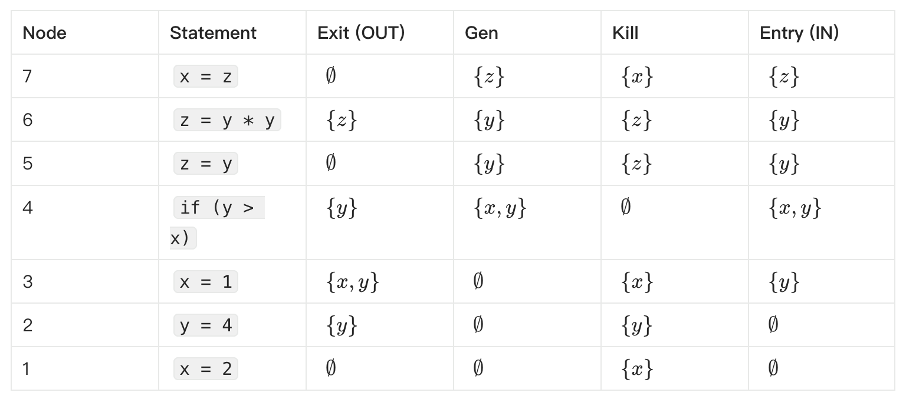

数据流分析总结

根据数据流分析六要素对上述三个分析问题总结如下：

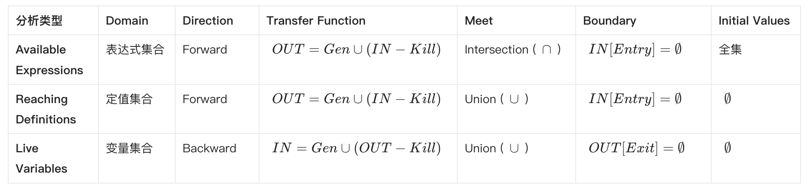

## Part 02

### 不动点求解算法

在上述问题的分析中，我们都是通过手动分析来对问题进行求解，在实际执行中，如何让计算机自动求解出每个点的状态呢？这就涉及到不动点算法

迭代算法 (Iterative Algorithm)

最朴素的方法是遍历所有语句，不断应用 Transfer Function 更新状态，直到所有点的状态都不再发生变化（达到 Fixed Point）

缺点：效率低。每次循环都要重新计算所有节点，即使某些节点的状态并没有改变

工作列表算法 (Worklist Algorithm)

Worklist算法是实践中的标准算法，是对迭代算法的优化。其核心思想是维护一个 Worklist（通常是队列或栈），仅存储那些输入状态发生了变化，需要重新计算的节点。

流程：

初始化所有节点，将起始节点加入 Worklist。

当 Worklist 不为空时，取出一个节点

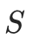

。

计算


的输出状态。如果输出状态相对于上一次发生了变化 (Change)，则将


的所有后继节点（Successors）加入 Worklist。

优势：避免了大量的重复计算，利用了程序控制流的局部性依赖。

根据前文我们已经分析过的到达定值分析例子，应用Worklist算法对其不动点进行求解

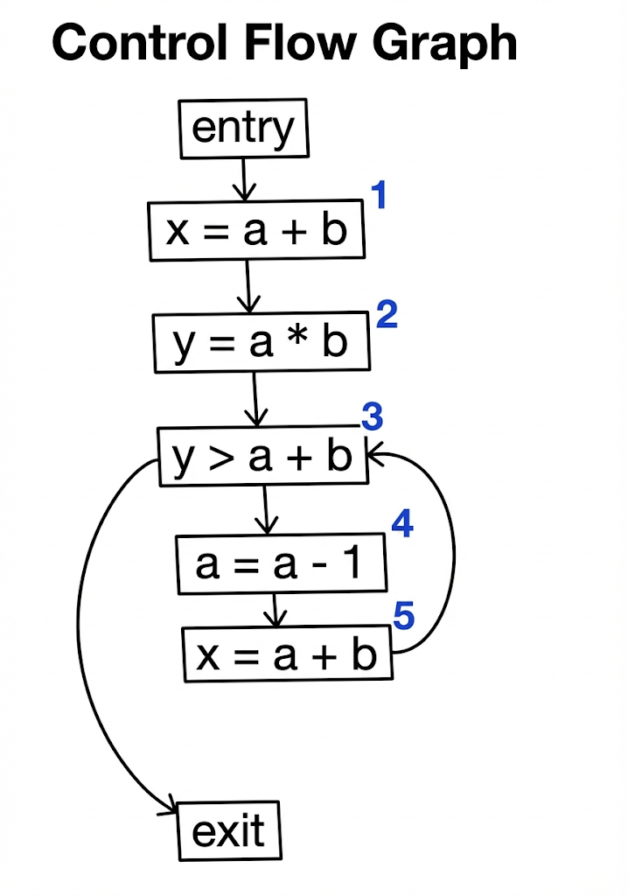

第 1 轮迭代

起始Worklist: {1, 2, 3, 4, 5}

处理节点 1:

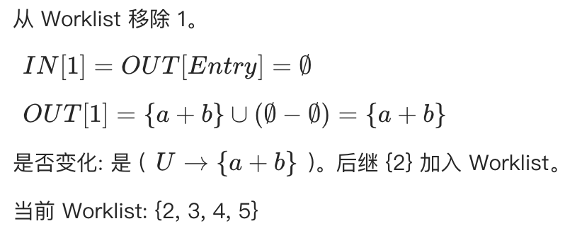

处理节点 2:

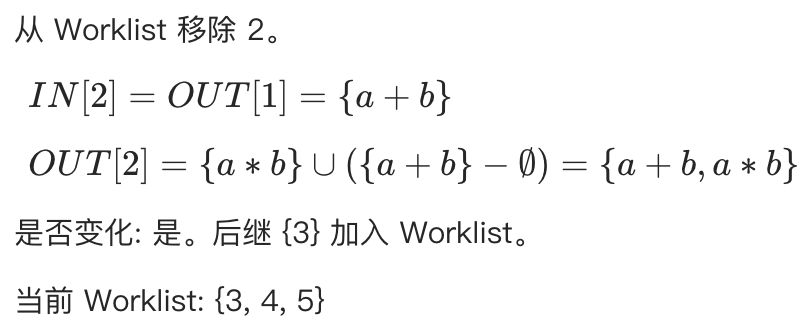

处理节点 3 (汇合点):

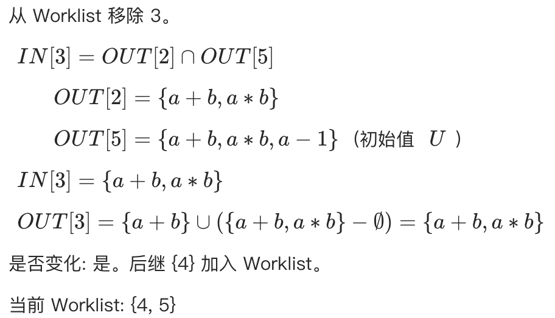

处理节点 4:

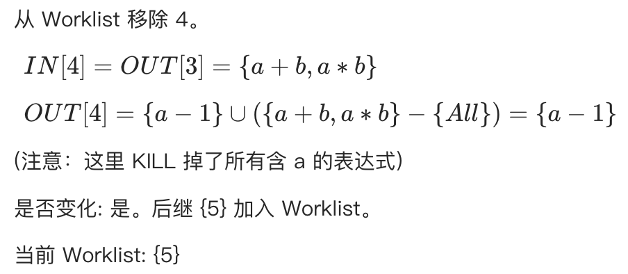

处理节点 5:

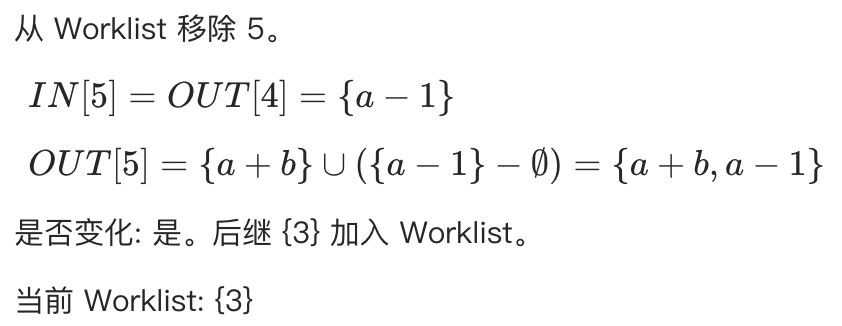

第 2 轮迭代 (处理循环回边带来的变化)

再次处理节点 3:

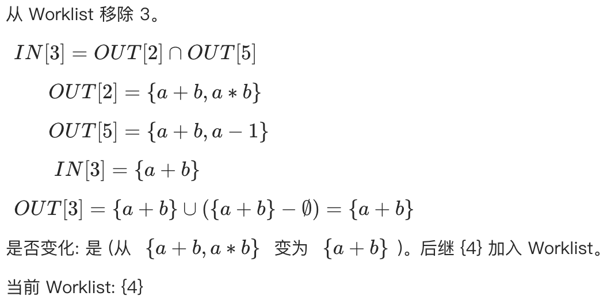

再次处理节点 4:

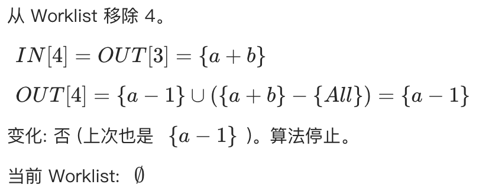

此时算法结束，达到不动点，我们也完成了这个代码片段的可用表达式分析。

## Part 03

### 过程间分析（Inter-procedural Analysis）

上述算法主要针对单个函数内（Intra-procedural）的。当涉及函数调用时，我们需要构建过程间控制流图 (ICFG)，并处理参数传递 (args) 和返回值 (ret) 的数据流向。该过程首先需要构建Call Graph，然后按照Call Graph来合并不同函数内的CFG并且处理Caller和Callee处的上下文敏感性。

Call Graph 的定义与构建流程

Call Graph (调用图) 以图形化的方式展示了程序中函数之间的调用关系

节点 (Nodes)：代表程序中的函数

边 (Edges)：代表调用关系。如果函数 A 调用了函数 B，则存在一条从 A到 B 的有向边

构建过程：

Call Graph 的构建通常从程序的入口点（如 main 函数）开始，遵循以下步骤：

扫描：分析当前函数的代码，寻找所有的调用语句 (Call Sites)

解析：确定每个调用语句的目标函数 (Callee)

对于静态调用（如 foo()），目标函数名直接写在代码中，非常容易确定

连边：在调用者 (Caller) 和被调用者 (Callee) 建立连接

递归：对所有新发现的可达函数重复上述过程，直到覆盖所有可达代码

然而，当遇到动态特性（如虚函数、函数指针）时，第2步“解析目标”会变得非常困难

挑战一：虚函数与对象多态

当代码中存在继承关系时，静态分析面临的一个挑战是确定具体的调用目标 (Dispatch Target)，如下图所示，main 函数中定义了基类指针 base，并根据条件 phi 初始化：

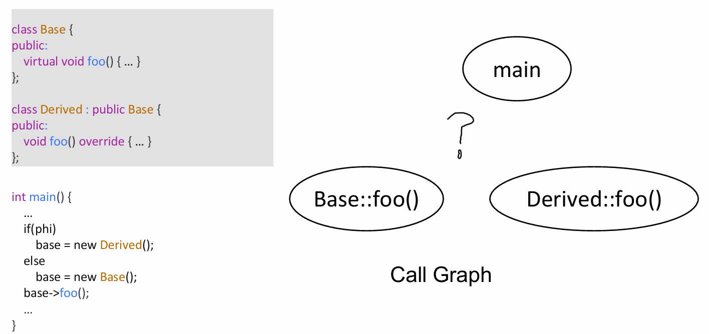

这里的 phi 代表运行时才能确定的条件（如用户输入）

在编译时（静态分析阶段），我们无法确定 phi 的值，因此无法确定 base 到底指向 Base 还是 Derived 的实例，也就无法确定 base->foo() 具体调用的是哪一个版本的函数

通常的解决方法是，为了保证分析的 Soundness（即不漏报任何可能的执行路径），我们对程序进行 Over-approximation（过近似）。即我们将指向 Base::foo 和 Derived::foo 的边都连上。虽然这可能引入虚假路径（False Positive），但它确保了分析结果涵盖了所有可能的运行时情况（May Analysis）

挑战二：函数指针

函数指针的指向分析比虚函数更为困难，因为指针可以指向任何签名匹配的函数。

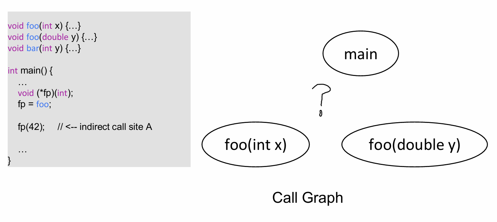

构建 Call Graph 时通常有两种策略：

基于类型的匹配 (Type-Based / Signature Matching)

原理：只要函数的签名（参数类型、返回值）与函数指针调用的签名一致，就认为可能是目标函数

分析：

fp 的签名是 void(int)。

foo(int)：匹配

bar(int)：匹配

foo(double)：不匹配（参数类型不同）

结果：

分析器会认为 fp 可能指向 foo(int) 或 bar(int)。虽然 bar 实际上从未被赋值给 fp，但这种简单粗暴的方法无法排除它，从而产生虚假边 (False Positive)

指针分析 (Pointer Analysis)

原理：通过数据流分析，追踪函数指针变量在程序中的实际赋值情况

分析：分析器追踪数据流，发现语句 fp = foo

结果：精确地确定 fp指向 foo(int)，排除了 bar(int)

权衡：这种方法精度高，但计算开销大


YASA小助手

YASA 内置 callgraph 检查器，结合 UAST 与指针分析，支持多语言调用关系构建。在 entrypointMode 配置下自动/自定义收集入口点，使用 dumpAllCG 命令可输出完整调用图

过程间控制流图 (ICFG)

之前我们定义的控制流图（CFG）是针对过程内部的，只有一个entry节点和一个exit节点。现在我们程序由多个过程组成，需要根据函数调用图（Call Graph）将不同的过程内控制流图合并。则这样的程序就对应多个控制流图，对于过程p，对应控制流图的入口节点为entryp，出口节点为exitp。同时，控制流图上会有两类特殊的节点，过程调用节点负责调用一个其他过程，过程返回节点负责处理调用过程的返回值。过程调用节点没有后继节点，而过程返回节点的前驱节点为过程调用节点的前驱节点 [2]。

以如下程序为例[3]，bar函数在主过程中存在两处调用，处理过程调用的方式就是直接的方式就是把不同过程的控制流图连起来，以此构建ICFG。如果有一个过程调用节点call调用了过程p，同时对应的过程返回节点为ret，那么我们就添加两条边：从call到entryp，从exitp到resume。

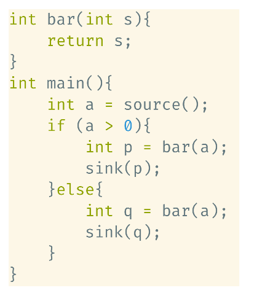

按照上述过程，我们可以构建出如下的ICFG：

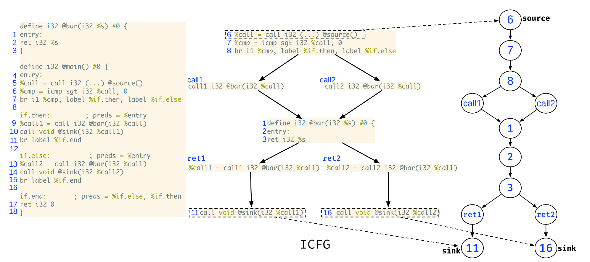

然而上述ICFG是上下文不敏感的，根据上述ICFG，可以得到四条污点路径，从node 6到node 11存在两条路径，其中call 1到ret 1的路径是可达的，而call 2到ret 1的路径是不可达的；类似的，从node 6到node 12也存在两条路径，其中call 2到ret 2的路径是可达的，而call 1到ret 2的路径是不可达的。

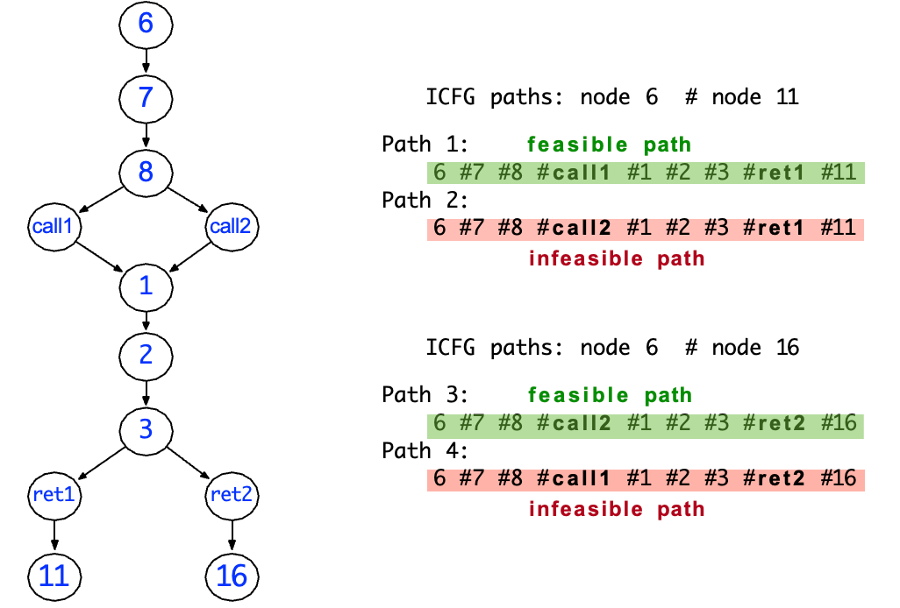

上下文敏感的过程间分析

上述方法之所以会产生不精确，是因为在分析过程中混淆了不同调用上的结果。比如A过程和B过程都调用了C过程，但A过程传入C的值对应的返回值可能会流入B过程。即会考虑实际不可能出现的执行轨迹。

为了区分同一个函数在不同位置被调用时的状态，我们需要引入上下文敏感 (Context Sensitivity)的分析。

具体而言，在引入过程调用之后，我们需要在程序执行状态中额外包含一个调用栈，才能进行正确的返回。这里的调用栈是一个序列，按顺序包括所有之前执行了但还没有返回的过程调用节点。

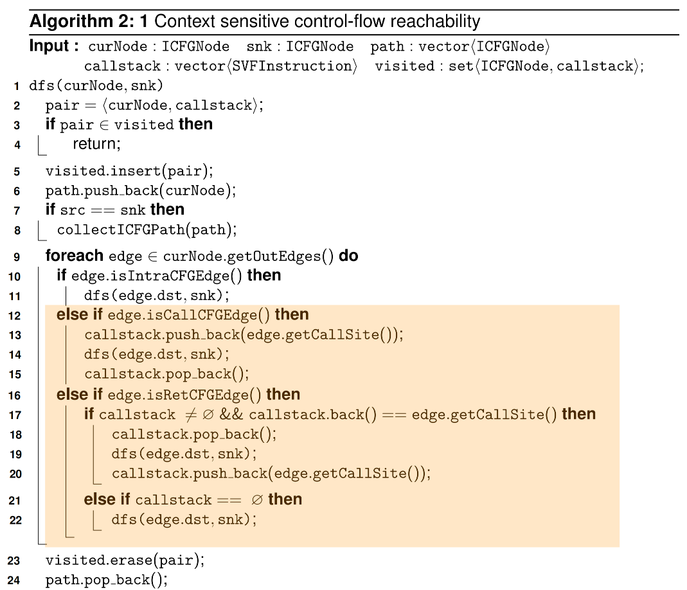

在上述算法中[3]，实现上下文敏感性的关键，就是在控制流搜索的状态里加入调用栈 (callstack)，并且在遍历 ICFG 时用它来精确地模拟call/ret匹配关系。

具体可以从三个方面来理解：

状态扩展

算法在 DFS 时，并不是简单地以当前 ICFG 结点 curNode 作为一个状态，而是把curNode和callstack作为整体加入 visited 集合中。

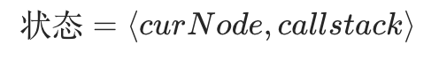

这意味着对于同一个程序点，如果是由不同的调用序列走到的，在分析中会被视作不同的上下文，分别处理，而不会互相混淆。例如，bar() 被 main() 和 foo() 分别调用两次，即使控制流图中的结点是同一个 entry_bar，但：

到达 entry_bar 时，调用栈为 [main::call1] 与

到达 entry_bar 时，调用栈为 [foo::call2]

这两个配置在 visited 中是两个不同的元素，因此两条路径会分别继续展开。

调用边：在 call 处压栈，记录调用上下文

当算法遇到一条调用边 edge.isCallCFGEdge() 时，会执行：

```text
callstack.push_back(edge.getCallSite());
dfs(edge.dst, snk);
callstack.pop_back();
```

其中 edge.getCallSite() 表示当前这条调用指令（call-site）。

将其压入 callstack，相当于在抽象解释中记下从这个位置发起了一次调用，进入被调过程时，当前的上下文信息就带上了具体是从哪个 call-site 进入的。后续在该被调函数内部进行的所有数据流传播，都会以带有这个调用点的调用栈为前缀，从而区分同一函数由不同位置调用时的分析结果。

返回边：在 ret 处匹配并弹栈，保证call/ret成对出现

对于返回边 edge.isRetCFGEdge()，算法并不是无条件地沿着这条边返回到任意的调用点，而是做了一个精确匹配检查：

```cs
if callstack ≠ ∅ && callstack.back() == edge.getCallSite() then
    callstack.pop_back();
    dfs(edge.dst, snk);
    callstack.push_back(edge.getCallSite());
else if callstack == ∅ then
    dfs(edge.dst, snk);
```

callstack.back()

代表当前“最内层尚未返回”的调用点；

edge.getCallSite()

描述这条返回边准备返回到哪个 call-site 之后的结点。

只有在这两个调用点相等时，算法才允许：

弹出栈顶（模拟真正执行中的函数返回），

从 edge.dst 继续做 DFS。

但是，上述算法在大多数实际程序仍然存在局限性，主要问题在于：算法中的调用栈是一个无穷的集合，当程序中出现深层次重复函数，就会出现指数爆炸；此外，上述算法也难以处理递归调用的情况。

通常的做法是取最近k次调用，即调用栈的长度最多为k。这样抽象调用栈就变成了一个有穷集合。关于k-CFA的分析作为拓展内容，可以参考相关资料[2]进一步学习。


YASA小助手

YASA 将函数调用栈，全局变量状态，所处的分支作为上下文信息，支持有限调用栈上下文敏感的全程序分析，并在此基础上通过插件化的 Checker 来实现污点追踪。

## Part 04

### 结语

数据流分析是静态程序分析中最经典的计算模型。通过定义抽象域、转移函数和汇聚操作，我们可以将各种复杂的程序属性检测问题（如空指针、未初始化变量、污点传播）转化为图上的不动点求解问题。对于过程间的数据流分析问题的拓展，需要引入函数调用图和过程间控制流图，也引入了上下文敏感性的一系列问题。时至今日，动态和弱类型语言上的函数调用图构建和上下文敏感分析仍然是一个非常重要的研究话题。

参考资料

[1] 静态程序分析. 李越，谭添.

https://cs.nju.edu.cn/tiantan/software-analysis/DFA-AP.pdf

[2] 软件分析技术课程讲义. 熊英飞.

https://xiongyingfei.github.io/SA_new/2025/slides/lecnotes.pdf

[3] Software Security Analysis. Yulei Sui.

https://github.com/SVF-tools/Software-Security-Analysis/wiki

关联阅读

开课啦 | 华中科技大学与蚂蚁基础安全团队联合开设《静态程序分析原理与实践》课程

高校教学系列：程序分析—基础概念

高校教学系列：程序分析—中间表示

长按识别二维码

关注“开放式安全基础设施”


在这里与上千名技术精英

交流技术干货&程序分析
