# 高校教学系列：程序分析—指针分析及抽象解释

> 发布时间：2025-12-18T20:37:46+08:00
> 公众号原文：[打开官方页面](https://mp.weixin.qq.com/s?__biz=MzU1NTc1NDMxMQ==&mid=2247484320&idx=1&sn=f306868888b67d001729ff18ef5abadc&chksm=fbce3588ccb9bc9e900831b3670b3bb609b078e7425c6fccc2b68366172997dafbd79ce8bf73)
> 本文件用于 GitHub 直接阅读：正文顺序来自原文，图片使用仓库中的本地副本；复杂公众号装饰样式请对照 `article.html`。

在上一篇笔记中，我们介绍了数据流分析的基本概念与应用，为理解程序状态变化提供了基础框架。本篇将进一步探讨指针分析，并正式介绍抽象解释框架。指针分析通过追踪变量指向关系解决别名问题；抽象解释则利用抽象域和抽象状态，将程序可能的运行行为进行近似，从而在保证安全性的前提下进行高效分析。本篇将以概念讲解结合示例的方式，展示这些方法的基本原理及应用场景。

本文作者信息如下：


曾珺

华中科技大学网络空间安全学院硕士生

Security PRIDE研究团队成员

Github主页：

https://github.com/JIRUWOZHI


王申奥

华中科技大学网络空间安全学院博士生

Security PRIDE研究团队成员

个人主页：

https://shenaow.github.io/

## Part 01

### 指针分析

在静态分析中，指针是最让人头疼的语言特性之一。它不仅决定一个变量的值，还决定了程序实际访问的内存位置。而现代程序的大部分数据访问，如结构体字段、堆内存、全局对象、函数参数，都通过指针完成。如果在编译阶段无法判断“某个指针到底指向哪里”，那么所有依赖内存关系的分析都会变得不准确甚至无法进行。指针分析正是为解决这一难题而提出的核心基础技术，其的首要任务是恢复程序的潜在内存结构，通过构建“指针 → 可能对象集合”的映射，补全程序在语法层面不可见的间接访问关系。 可以说，指针分析为静态分析补齐了理解内存行为的关键一环，让分析工具能够以接近真实执行的视角推理程序状态，从而为后续如污点分析和漏洞检测等任务提供基础。

在本小节中，我们将首先介绍指针/别名分析的基本原理，帮助理解指针在程序中如何影响内存访问。随后，将讨论分析精度的不同维度，包括流敏感性、上下文敏感性与路径敏感性。最后，我们将介绍 Andersen 算法，以一个简单的例子带大家了解指针分析的实际作用。

### 1.1 基础概念：指针分析

指针分析（Pointer Analysis），又叫指向性分析（Point-to Analysis）或者别名分析（Alias Analysis），是静态分析中的核心技术，其目标是在编译阶段尽可能精确地确定指针在运行时可能指向的内存对象。它通过计算每个指针变量的points-to集合，即该指针可能引用的地址被取过的变量集合，来恢复程序的潜在内存结构。

示例：考虑如下代码片段

```cs
int a, b;
int *p = &a;
int *q = p;
```

在这个例子中，p 和 q 的 points-to 集合均为 {a}，说明两者都可能指向变量 a。通过这种映射，分析工具可以重建程序的潜在内存结构。

```bash
pts(p) = pts(q) = {a}  #指针p和指针q的points-to集合
```

别名关系是指针分析的需要回答的一个核心问题，用于判断两个指针解引用是否可能指向同一块内存。如果两个指针的 points-to 集合存在交集，则说明 p 和 q 是别名，它们的解引用可能访问同一内存位置。

```css
pts(p) ∩ pts(q) ≠ ∅  #指针p和q是别名
```

别名信息在程序优化和安全分析中具有重要作用。例如，在常量传播中，如果 *p = 1; x = *q; 且 p 与 q 是必然别名（must-alias），则可以确定 x 的值为 1；在污点分析中，如果 *p 被标记为受控输入，而 p 和 q 是别名，则通过 *q 读取的值也应被视为受控。

### 1.2 分析精度：流敏感性、上下文敏感性与路径敏感性

在静态分析中，精度是最核心的设计维度之一。在构建指针分析、数据流分析、污点分析时，我们通常需要在性能与精度之间做取舍，而“流敏感性”“上下文敏感性”和“路径敏感性”恰恰构成了这三类重要的精度维度。这三个维度分别对应：程序执行顺序、函数调用上下文、控制流路径条件。理解它们可以帮助我们判断某个静态分析工具到底能精确到什么程度，也能帮助你自己设计更合理的分析策略。

流敏感性（Flow Sensitivity）

流敏感性关注程序 执行顺序，也就是不同语句之间前后的关系。

流不敏感（Flow-insensitive）：

完全忽略执行顺序，把所有指针相关语句放一起分析；分析结果给出一个“全局可能性”，但无法分清不同程序点的状态。

流敏感（Flow-sensitive）：

分析按程序顺序推进，每一行代码都有独立状态；因此能区分出不同时间点指针指向的变化情况。

示例：考虑如下代码片段

```nginx
if (True){
    x = 3
    x = 5  //变量x在这里的值是什么？
}
```

流敏感分析会严格按照语句的执行顺序逐步更新变量状态，因此能够在不同的程序点给出不同的分析结果。比如一段代码先执行 x = 3，紧接着又执行 x = 5，那么在第二条语句处，流敏感分析能够明确得出此时 x 的值就是 5。相反，流不敏感分析会将所有赋值语句统一合并来看，不区分先后关系，因此只能得出 x 可能是 3 或 5。

上下文敏感性（Context Sensitivity）

上下文敏感性关注的是函数在不同调用场景下是否被区分对待。

上下文不敏感（Context-insensitive）：

所有函数调用场景被合并，即函数的行为在任何调用点都被认为相同。

上下文敏感（Context-sensitive）：

区分不同的调用路径，为每个调用上下文分别分析。

示例：考虑如下代码片段

```javascript
function f(x) {
  n = 1 //n是全局变量
  if(x) {
    g(3)
  } else {
    n = 3
    g(5)
  }
}

function g(y){ //变量n在此处是否会等于y？
  //codes ...
}
```

在上下文不敏感分析中，所有对函数 g 的调用都会被统一合并处理，因此分析器无法区分 g 在不同条件下被调用时所处的变量状态。对于上面的示例，它会认为 g 有可能在 n = 1 或 n = 3 的任意状态下执行，同时参数 y 也可能是 3 或 5。由于所有上下文被混合在一起，分析结果会给出“n 可能等于 y”的结论。

而在上下文敏感分析中，这两次调用会被区分处理： 当 x 为 true 时，n = 1，调用 g(3)；而当 x 为 false 时，n = 3，调用 g(5)。在第一条路径中，n = 1 而 y = 3，在第二条路径中，n = 3 而 y = 5。因此，分析可以准确得出结论，在任何调用上下文中，n 都不会等于 y。

路径敏感性（Path Sensitivity）

路径敏感性用于处理 if / while 等控制流的分支语义：

路径不敏感（Path-insensitive）：

在控制流汇合点，所有路径的分析状态全部合并，导致分析较为保守。

路径敏感（Path-sensitive）：

分析会区分每条可能的路径，只有在条件一致的路径上才会合并状态。

示例：考虑如下代码片段

```apache
x = 0
if(a > 0)
  x = 1
else
  x = 2
if(a > 0)
  x += 3
#当程序运行到这里时，变量x是否会等于5？
```

在路径不敏感分析中，分析器会在控制流汇合点将所有分支的状态合并，因此无法区分不同条件下的执行结果。对于上面的示例，x 在第一个 if 分支中可能被赋值为 1 或 2，第二个 if 再加 3 时，分析器会将两种可能性合并， 得出 x可能是 4 或 5。由于路径信息被忽略，分析器会认为在程序运行到这里时 x 可能等于 5。

而在路径敏感分析中，分析器会区分不同条件路径进行跟踪：在 a > 0 的路径上，x 先被赋值为 1，再加 3，最终 x = 4；在 a <= 0 的路径上，x 被赋值为 2，由于a值不满足if 分支的条件所以不会执行加3的操作，最终x = 2。因此，路径敏感分析能够精确区分每条执行路径，并正确指出在程序运行到这里时，x 并不总是等于 5。


YASA小助手

YASA从程序入口点对程序解释执行的过程进行有界模拟，牺牲一部分循环语句的深层模拟，从而支持流敏感，域敏感，上下文敏感和路径敏感的分析。

### 1.3 Andersen算法：最经典的指针分析算法

Andersen 算法[1]是一种经典的基于约束的指针分析法，它在静态分析领域广泛使用，并被认为是最稳健、最受欢迎的包含式指针分析算法。该算法属于流不敏感、上下文不敏感、路径不敏感的分析类型，其核心目标是通计算每个指针的 points-to 集合。 算法首先将程序抽象为一个约束图，其中指针变量和对象分别映射为图节点，而各种指针相关操作（赋值、取地址、间接访问等）被映射为节点之间的约束边。分析过程中，算法不断沿着这些约束边传播 points-to 信息，通过迭代直至所有节点的 points-to 集合达到不再变化的固定点。

在字段敏感的扩展中，算法可以区分对象的不同字段，从而提升分析精度。例如，q = &p->fld 会将指针 q 与 p 的字段 fld 关联，使 points-to 集合精确到字段级别，而不仅是整个对象。这对于堆对象、栈对象以及全局对象的分析非常重要。

下表列出了 Field-Sensitive Andersen 算法在不同 LLVM IR / C 代码操作下的约束传播规则示意：

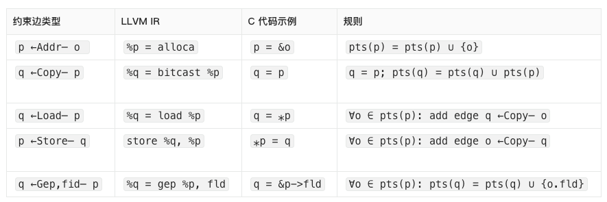

约束求解流程

指针分析的核心是对上述约束进行求解。标准的 Andersen 求解过程通常基于Worklist算法，其步骤如下：

初始化阶段：

对每条 address（addr）约束 p ←Addr— o，将 {o} 加入 pts(p)。

将所有有入边 addr 的节点加入工作队列。

从 worklist 中弹出节点 p：

对节点 p 的各类入边、出边进行处理：

处理 store 边：

对每条 p ←store q，对于 o ∈ pts(p)，添加 o ←Copy— q 边。

处理 load 边：

对每条 q ←load p，对于 o ∈ pts(p)，添加 q ←Copy— o 边。

处理 copy 和 field/gep 边：

直接将 points-to 信息从源节点传播到目标节点，或将字段化的 points-to 信息加入相应字段节点。

触发重新加入 worklist 的条件：

若节点的 points-to 集合发生变化，则重新将其加入队列。

若由于 load/store 引入了新的 copy 约束边，则 copy 边的源节点也会加入队列继续传播。

收敛（Fixpoint）：

随着所有约束被反复传播，当不再产生新的 copy 边，且所有节点的 points-to 集合不再变化时，整个分析达到固定点，此时指针关系的推导完成。

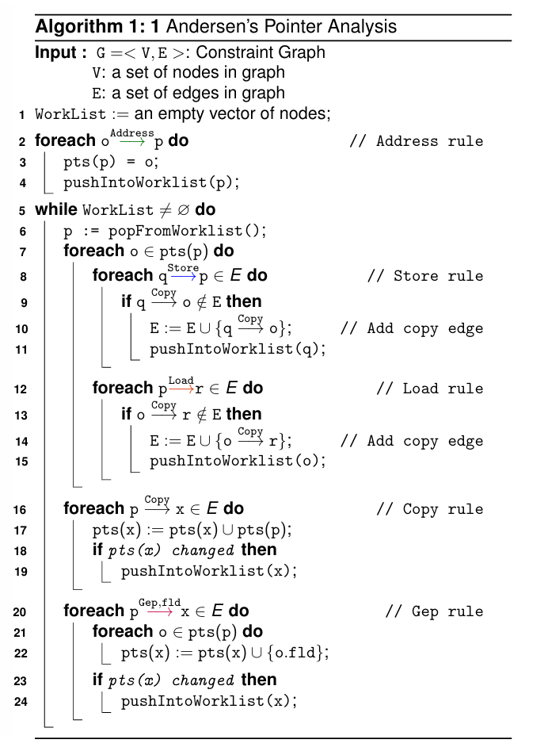

示例：Andersen 算法的完整求解流程

首先，对于一个 C 语言程序，需要将其转换为 LLVM IR 的中间表示形式，示例如下[2]。

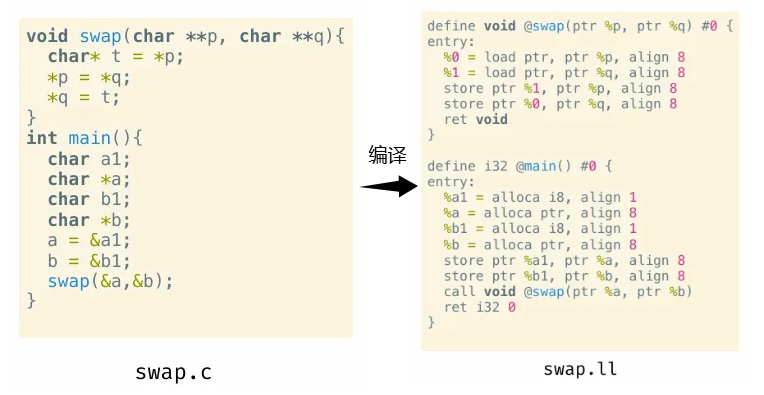

在初始化阶段，分析器会识别 IR 中的所有操作，并构建每个节点之间的初始约束关系。随后，算法根据 Address 操作边，将 %a1、%b1、%a 和 %b 加入 WorkList。

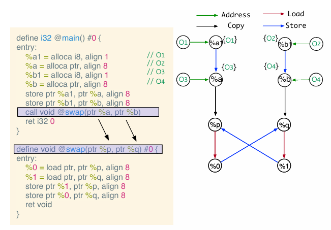

接下来，从 WorkList 中弹出 %a1 进行处理。由于 %a1 没有其他节点通过 Store 操作指向它，也没有指向其他节点的 Load、Copy 或 Gep,fld 操作，因此无需生成新的约束边。同理，处理 %b1 时也是相同的情况。

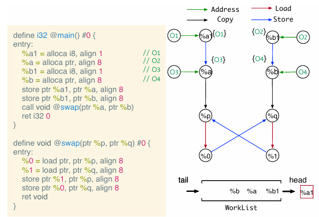

对于 %a 节点，由于存在 %a ←Store— %a1 的约束边，算法会将 %a 的 points-to 集合 {O3} 通过 Copy 规则传播，生成一条新的边 O3 ←Copy— %a1，并将 %a1 重新加入 WorkList 以便进一步处理。同时，存在 %p ←Copy— %a 的操作边，因此 %p 的 points-to 集合也会更新为 {O3}，并将 %p 加入 WorkList。对 %b 节点同样按照对称规则进行处理，逐步更新相关节点的 points-to 集合并生成新的约束边。

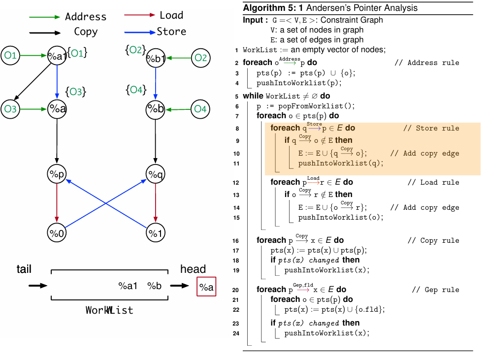

随着 WorkList 中节点被不断弹出和处理，新的 Copy 边和 points-to 信息会持续在约束图中传播和更新。每一次迭代都使指针与其可能指向的对象关系更加准确地反映在图中，直到整个系统收敛。最终，当 WorkList 为空，且没有节点的 points-to 集合发生变化，也没有新的 Copy 边被添加时，算法达到固定点，约束图构建完成，最终生成的约束图如图所示。

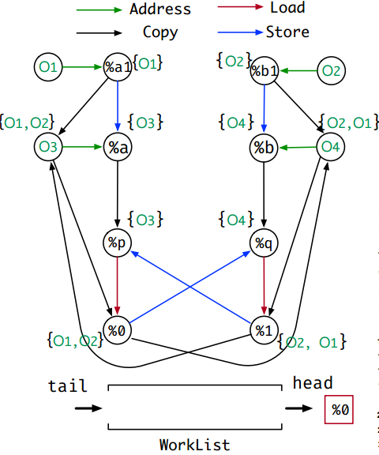

## Part 02

### 抽象解释

在前面的小节中，我们介绍了指针分析，用于确定指针可能指向的对象以及追踪敏感信息在程序中的流动。指针分析虽然功能强大，但在实际应用中仍面临一个共同问题：程序的状态空间可能非常巨大，尤其是在存在多级指针、函数调用和循环结构时。直接对每一种可能状态进行精确分析，不仅计算成本高，而且有时根本无法完成。

抽象解释[3]（Abstract Interpretation）正是在这样的背景下提出的。它是一种静态分析理论，用于在不执行程序的情况下，推断程序的行为和性质。其核心思想是通过构建程序行为的抽象模型，在保证分析安全性的前提下，对程序可能的状态空间进行近似推理。与精确执行相比，抽象解释不关注每一个具体值，而是关注变量可能取值的范围、指针可能指向的对象集合，或者污点信息的流动状态等抽象属性。 其提供了一套系统方法，通过定义抽象域、抽象传递函数以及固定点求解算法，实现对程序状态的安全近似推理，从而能够在可控复杂度下分析大规模程序的潜在漏洞或安全风险。

### 2.1 抽象解释的基本概念

在抽象解释中，程序中可能存在无限的具体值，需要将其映射为有限的抽象值，以便进行静态分析。为此引入抽象域（Abstract Domain）的概念，它通过形式化结构管理这些抽象值。

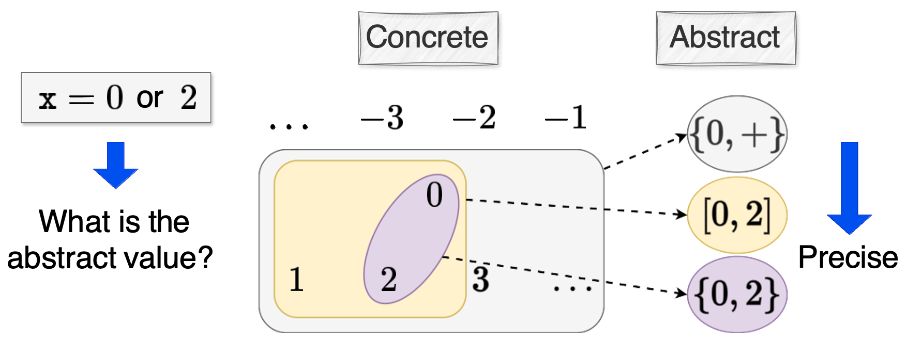

如上图所示[4]，对于表达式x = 0 or 2，可以将其从所有整数的具体域进行抽象，抽象方式可以有三种，其一是符号域（{0, +}），在符号域中我们只关心x的符号是正负还是零；再精确一些的话我们可以定义区间域（[0, 2]），此时我们关心的是x的取值范围；更精确的情况可以分析x的具体值，但是抽象域越精确，分析的时间/空间开销也就越大。

抽象域的核心是偏序关系（Partial Order），记作 ⊑，用于描述抽象值之间的包含或大小关系。偏序关系需满足以下条件：

```makefile
自反性:      ∀x ∈ S, x ⊑ x
传递性:      ∀x,y,z ∈ S, x ⊑ y ∧ y ⊑ z ⇒ x ⊑ z
反对称性:    ∀x,y ∈ S, x ⊑ y ∧ y ⊑ x ⇒ x = y
```

在偏序集合上，可以定义上下界（Bounds）：

```text
上界 (Upper Bound): y 是 X 的上界当且仅当 ∀x ∈ X: x ⊑ y
下界 (Lower Bound): y 是 X 的下界当且仅当 ∀x ∈ X: y ⊑ x
最小上界 (Least Upper Bound, ⨆X): X ⊑ ⨆X ∧ ∀y∈S: X⊑ y ⇒ ⨆X ⊑ y
最大下界 (Greatest Lower Bound, ⨅X): ⨅X ⊑ X ∧ ∀y∈S: y ⊑ X ⇒ y ⊑ ⨅X
```

如果偏序集合中任意两个元素都存在最小上界和最大下界，则形成一个格（Lattice）：

```nginx
x ⊔ y = x 的最小上界与 y 的最小上界
x ⊓ y = x 的最大下界与 y 的最大下界
```

当任意子集都有最小上界和最大下界时，则称为完备格（Complete Lattice），并具有唯一最大元素 ⊤ 和最小元素 ⊥。

一个直观例子是幂集格（Powerset Lattice）：

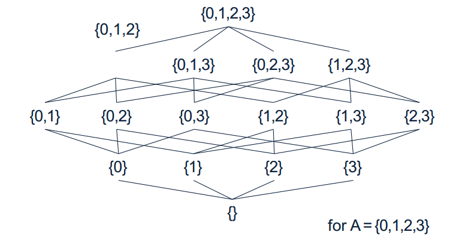

例如，给定集合 A={0,1,2,3}，其幂集 P(A)包含所有子集，构成一个完备格。最小元素 ⊥= ∅（空集），最大元素 ⊤= {0,1,2,3}（全集）。对于任意两个子集，例如 x={0,1} 和 y={1,2}}，可以计算它们的最小上界与最大下界：

```apache
x = {0,1}
y = {1,2}

x ⊔ y = x | y  # 并集，结果 {0,1,2}
x ⊓ y = x & y  # 交集，结果 {1}
```

通过这样的格结构，我们可以安全地近似程序变量可能的值集合。例如指针分析中，某个指针可能指向的内存对象集合可以表示为幂集格的一个元素；在污点分析中，某变量可能的污点状态也可以被映射到抽象值，从而为静态分析提供可操作的模型。

此外，格的高度（Lattice Height）定义为从最小元素 ⊥ 到最大元素 ⊤的最长路径长度。在幂集格 (P(A),⊆)中，格的高度等于集合 AAA 的元素个数 ∣A∣。高度的概念在抽象解释中非常重要，因为它影响固定点计算的迭代次数和分析复杂度。

### 2.2 典型抽象域

程序分析中，不同变量类型和分析目标对应不同的抽象域。常见的抽象域有符号域、区间域、布尔域、指针域等，它们为静态分析提供了可操作的模型，这里简单介绍一下符号域和区间域。

符号域（Sign Domain）

符号域是一种通过变量的符号信息对具体值集合进行抽象的域。例如，一个整数变量可以取正数、零或负数，对应的抽象值集合为 {+, 0, -}。符号域通常采用格结构来定义：

```ini
L = < P({-, 0, +}), ⊆, ⊓, ⊔, ⊥, ⊤ >
```

其中，⊆ 表示部分序关系，⊓ 和 ⊔ 分别是下确界和上确界运算，⊥ 和 ⊤ 分别表示最小和最大抽象元素。例如：

{+} ⊆ {0,+}

表示正数集合被零或正数集合包含。

{+} ⊓ {0} = ⊥

两集合的交集为空。

{+} ⊔ {0} = {0,+}

两集合的并集为 {0,+}。

在符号域中，具体值集合 {1,3} 可以被抽象为 {+}，通过反抽象（concretization）可恢复为 { x ∈ Z | x > 0 }，是具体值集合的一个上界近似。符号域可以用于快速判断数值的符号关系、检测可能的零除错误或条件分支分析。

区间域（Interval Domain）

区间域是一种表示整数集合的抽象域，通过上下界确定变量可能的取值范围。其格结构定义如下：

```ini
L_interval = < I, ⊆, ⊓, ⊔, ⊥, ⊤ >
I = { [a,b] | a,b ∈ Z ∪ {-∞,+∞} } ∪ {⊥}
```

部分序关系为：[a1,b1] ⊑ [a2,b2] 当且仅当 a2 ≤ a1 且 b1 ≤ b2。例如：

[0,0] ⊑ [0,1]，表示单点区间被更大的区间包含。

对于 [3,8] 和 [7,12]：

交集运算： [3,8] ⊓ [7,12] = [7,8]，为两区间的最大公共区间；

并集运算： [3,8] ⊔ [7,12] = [3,12]，为包含两区间的最小区间。

区间域适合分析变量的取值范围、循环边界及数组下标可能越界等问题，同时在符号域基础上提供更精细的数值近似。


YASA小助手

YASA也是基于抽象解释的基本思想，其抽象域选用了程序状态中有限的指针域，能够通过编写自定义checker收集程序中间状态的任意变量指向进行分析。

### 2.3 抽象状态与抽象轨迹

在静态分析中，除了定义抽象域来近似变量的取值外，还需要跟踪程序执行过程中变量的抽象状态和变化。

抽象状态（Abstract State）

抽象状态是程序在某个点上所有变量的抽象值集合，用于近似运行时的具体状态。形式化地，一个抽象状态 AS 定义为映射：

```nginx
AS : V → A
```

其中 V 是程序变量集合，A 是所选的抽象域。通过抽象状态，可以在不枚举所有具体值的情况下，描述程序变量的可能取值范围。例如，若变量 x 的抽象值为 [0,10]，表示在程序执行到该点时，x 的值可能落在 0 到 10 之间。

抽象轨迹（Abstract Trace）

抽象轨迹用于记录程序执行过程中每条语句前后的抽象状态。形式化地，抽象轨迹 σ 是一个映射：

```text
σ : L × V → A
```

其中 L 表示程序语句位置（program points），V 表示程序变量，A 表示抽象域的值。在实现中，可以分别定义语句前后的抽象状态（pre-abstract trace 和 post-abstract trace）：

```javascript
σ_L : V → A    // 程序点 L 的抽象状态
σ_L(x) ∈ A    // 程序点 L 处变量 x 的抽象值
```

通过抽象轨迹，分析器可以追踪变量在程序执行过程中的近似变化，为后续分析提供基础信息。

一个简单示例

为了更直观地理解抽象状态和抽象轨迹，下面给出一个简单的程序示例，并使用区间域进行分析。

在语句 ℓ_1 执行后，变量 a 的值被初始化为 0，在区间域中抽象为 [0,0]；变量 b 尚未赋值，对应的抽象值为最小元素 ⊥。因此，ℓ_1 之后的抽象状态为σ_ℓ1 = { a: [0,0]; b: ⊥ }，程序的抽象轨迹如图所示：

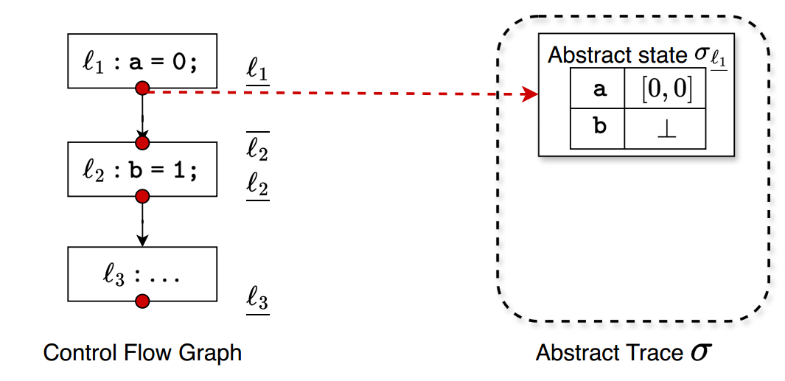

在语句 ℓ_2 执行后，变量 b 被赋值为 1，在区间域中抽象为 [1,1]；变量 a 的抽象值保持不变 [0,0]。因此，ℓ_2 之后的抽象状态为σ_ℓ2 = { a: [0,0]; b: [1,1] }，程序的抽象轨迹如图所示：

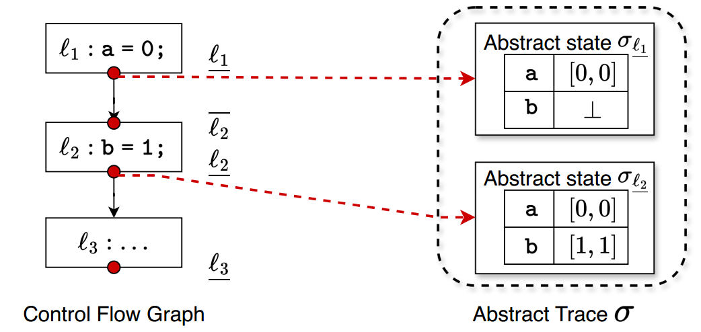

通过这个抽象轨迹，我们可以看到程序中每个变量在每个程序点上的可能取值范围。即使程序变量可能在运行时取任意具体值，区间域的抽象轨迹也能够提供一个上界近似，为进一步的静态分析（如范围检查、溢出检测、条件分支分析等）提供基础信息。

对于下图中的CFG，使用区间域来抽象变量 a 的取值范围，并在每个程序点 ℓ_i 维护一个抽象状态 σ_{ℓ_i}。表格中的抽象轨迹 σ_{ℓ_i}(a) 表示在不同分析阶段，分析器对程序点 ℓ_i 的变量 a 的近似值。

初始状态下，对所有程序点 ℓ_i，都有σ_{ℓ_i}(a) = ⊥

执行到 ℓ1 时，a 被赋值为常量 0，因此在区间域中表示成区间 [0, 0]

对于第一次循环：

ℓ2上的抽象状态源于其所有前驱节点的状态的并，即σ_ℓ2 = σ_ℓ1 ⊔ σ_ℓ3。在当前 CFG 中，ℓ2的前驱只有一个：ℓ1。因此，第一次迭代时把来自ℓ1的信息传到ℓ2，即σ_ℓ2 = σ_ℓ1 = [0, 0]

当控制流从ℓ2走到ℓ3时，说明分支条件 a < 10为真。我们可以利用这一信息对 a做条件约束：

ℓ2上的抽象值是 σ_ℓ2；分支条件为 a < 10，在区间域中，我们可以把 σ_ℓ2与条件 a < 10做一次求交（meet），得到满足分支条件的子区间；然后在 ℓ3 上对 a 执行算术操作 a++，即对区间整体加上 [1,1]，即σ_ℓ3 = ([-∞, 9] ⊓ σ_ℓ2) + [1,1]

由于σ_ℓ2 = σ_ℓ1 = [0, 0]，因此在第一次循环中，σ_ℓ3 = ([-∞, 9] ⊓ [0, 0]) + [1,1] = [1, 1]

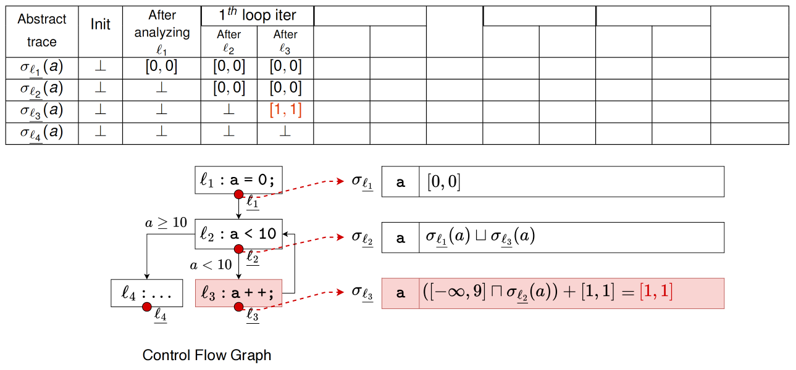

按照上述过程迭代求解程序的抽象轨迹，可以得到下表

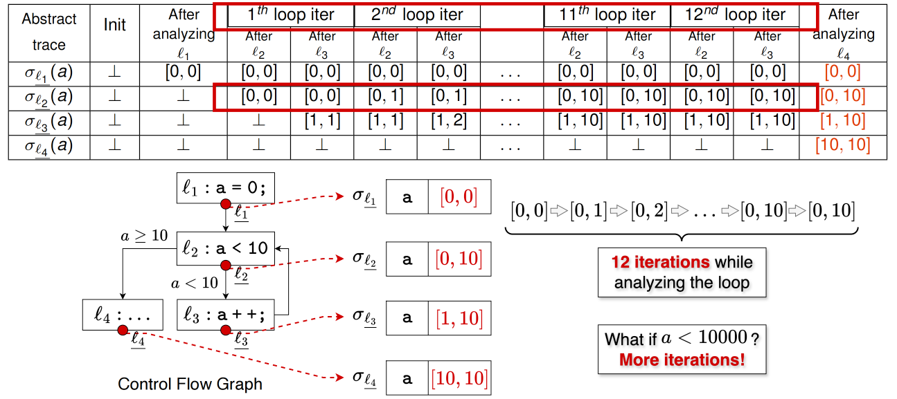

程序在第12次循环时达到不动点，最终的不动点状态时，σ_ℓ2 = [0, 10], σ_ℓ3 = [1, 10]

最终分析结果是，σ_ℓ1处a的取值范围是[0, 0],σ_ℓ2处a的取值范围是[0, 10],σ_ℓ3处a的取值范围是[1, 10],σ_ℓ4处a的取值范围是[10, 10]

当分支条件为a<10时，需要12次迭代来分析循环；试想，当分支条件为a<10000时，我们就需要10002次迭代来完成分析，这显然在实际分析中是无法接受的

因此，可以引入抽象解释的加宽（Widening）和变窄（Narrowing）来加速分析过程。

### 2.4 加宽（Widening）和变窄（Narrowing）

标准的抽象解释有可能收敛得很慢，甚至有可能因为半格的高度无限导致不收敛。为了让结果收敛得更快，可以使用加宽的方法。加宽之后结果也会随之变得不精确，这时候可以使用变窄的方法，进一步让结果变精确[4]。

应用Widening加速收敛

加宽的基本思路是在每次更新的时候，根据更新之前的值和新计算时的值，分析抽象值的变化趋势，然后根据变化趋势推测最终会收敛到的抽象值。

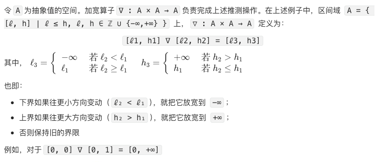

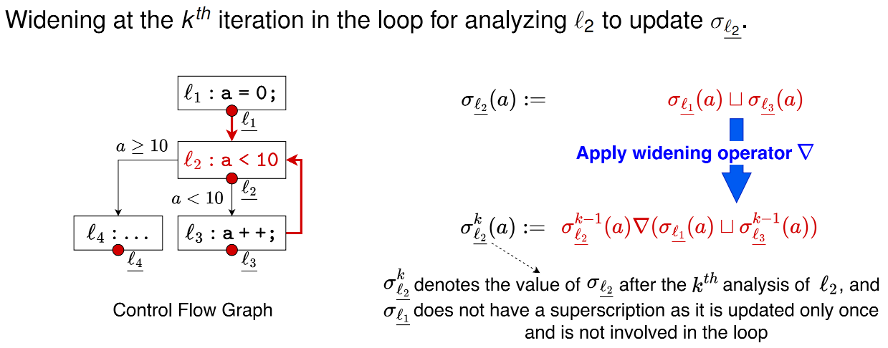

在上述程序中，我们只在循环头 ℓ₂ 上使用 widening，ℓ₂ 的更新规则写成：

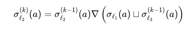

下面将 widening 算子应用上述程序分析的抽象解释中，过程如下：

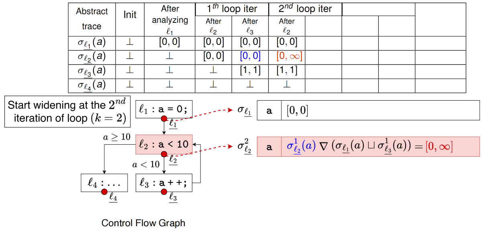

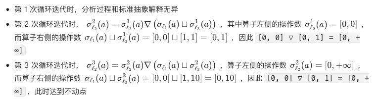

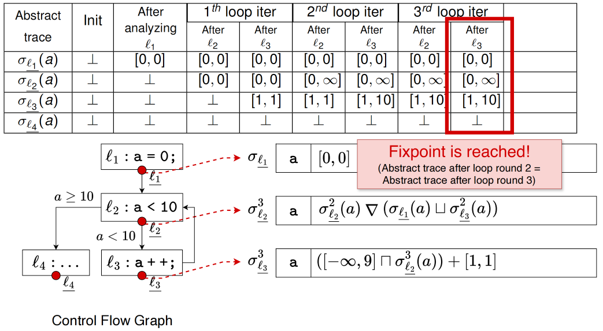

达到不动点状态时，σ_ℓ1处a的取值范围是[0, 0],σ_ℓ2处a的取值范围是[0, +∞],σ_ℓ3处a的取值范围是[1, 10],σ_ℓ4处a的取值范围是[10, +∞]

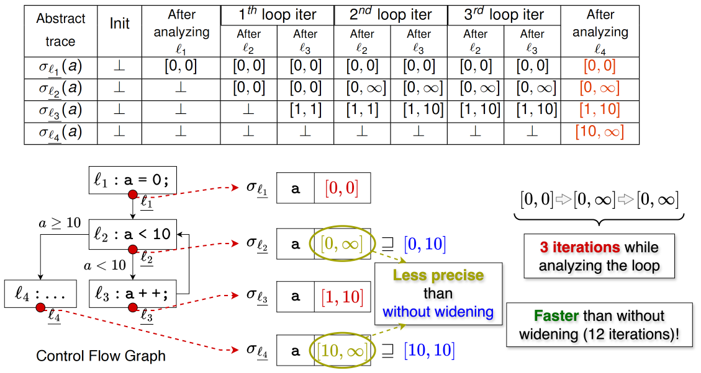

应用Narrowing修正结果

加宽虽然能加快收敛，但也会导致很多分析返回不精确的结果。为了解决这样的问题，变窄通过再次应用原始分析对加宽的结果进行修正。给定加宽分析的值作为初值，变窄应用原始抽象解释对该值进行多轮迭代更新[4]

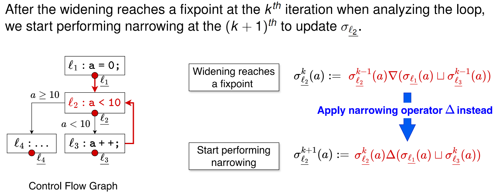

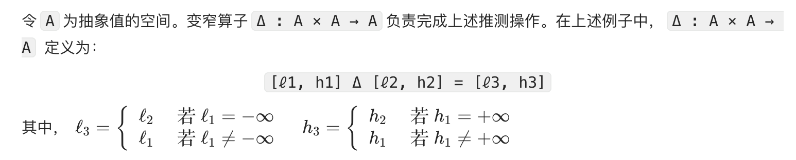

也即：

如果旧区间的下界是 −∞，就把下界收缩到新区间的下界 ℓ₂；

否则保持旧下界 ℓ₁ 不变；

如果旧区间的上界是 +∞，就把上界收缩到新区间的上界 h₂；

否则保持旧上界 h₁ 不变

例如，对于[0, +∞] Δ [0, 10] = [0, 10]

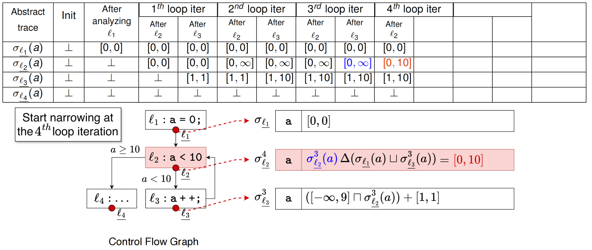

在上述widening达到不动点的程序而言，我们可以在第4次循环迭代时应用narrowing算子，


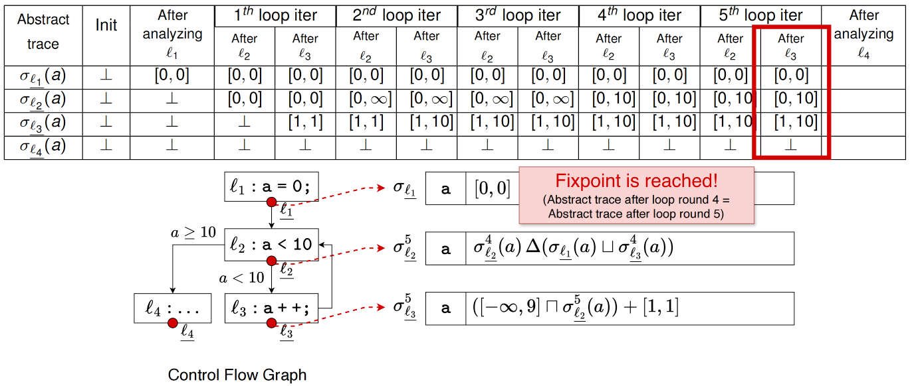

应用narrowing算子达到不动点状态时，σ_ℓ1处a的取值范围是[0, 0],σ_ℓ2处a的取值范围是[0, 10],σ_ℓ3处a的取值范围是[1, 10],σ_ℓ4处a的取值范围是[10, 10]

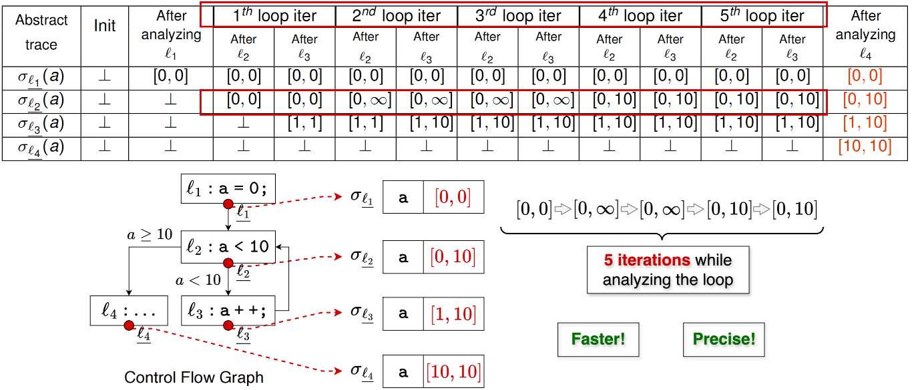

应用widening和narrowing算子，仅需要5次循环就能够求解到精确的区间结果，能够更快更精确地收敛。

## Part 03

### 结语

一般而言，程序分析是分析程序在给定输入集合下的所有具体执行序列具有的性质，抽象解释把这些看似各不相同的分析方法纳入了一个统一的数学框架中。从抽象解释的角度来看，这里的具体域的元素是任意的程序在任意输入集合下的所有具体执行序列集合，抽象域是这组具体执行对应的分析结果。事实上，几乎所有基于抽象法的静态分析任务，包括数据流分析和指针分析等，都可以用抽象解释的框架来理解并给出安全性证明。如果你能够坚持看到这里，大概率已经不再属于“使用抽象解释而不自知”的状态。无论你目前只是想应用静态分析解决某个安全问题，还是希望把现有工具提升到一个更可控、更可解释的层次，抽象解释都提供了一套统一的理论框架，和widening算子一样，never too late to upgrade！

到此，我们静态分析课程的原理部分也就结束了，希望这一系列的课程笔记能够帮助大家更好地理解静态分析！

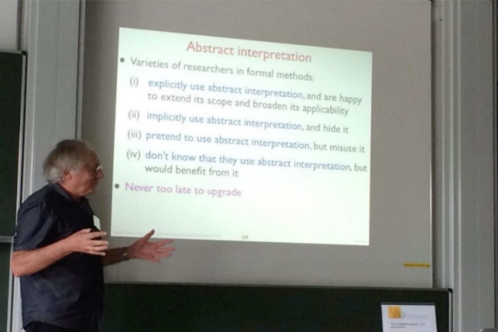

参考资料

[1] Andersen, L.O.: Program Analysis and Specialization for the C Programming Language.

[2] Software Security Analysis. Yulei Sui.

https://github.com/SVF-tools/Software-Security-Analysis/wiki

[3] Cousot P, Cousot R. Abstract interpretation: a unified lattice model for static analysis of programs by construction or approximation of fixpoints

[4] 软件分析技术课程讲义. 熊英飞.

https://xiongyingfei.github.io/SA_new/2025/slides/lecnotes.pdf

∨

YASA用户调研邀请

亲爱的社区伙伴们

感谢大家对YASA项目的关注与支持！

为了更好地了解大家的需求，优化产品体验

我们准备了一份简短的调研问卷

（填写约需2-3分钟）

扫描下方二维码完成问卷填写即可参与抽奖

有机会获得精美礼品！

如中奖请截图保存结果，添加 YASA 小助手微信（YASA1024）兑奖～


您的每一份反馈都对我们非常重要

期待听到您的宝贵建议！

关联阅读

开课啦 | 华中科技大学与蚂蚁基础安全团队联合开设《静态程序分析原理与实践》课程

高校教学系列：程序分析—基础概念

高校教学系列：程序分析—中间表示

高校教学系列：程序分析—数据流分析

高校教学系列：实验课程—YASA原理简介及功能演示

高校教学系列：实验课程—YASA内部机制深入解析

长按识别二维码

关注“开放式安全基础设施”


在这里与上千名技术精英

交流技术干货&程序分析
